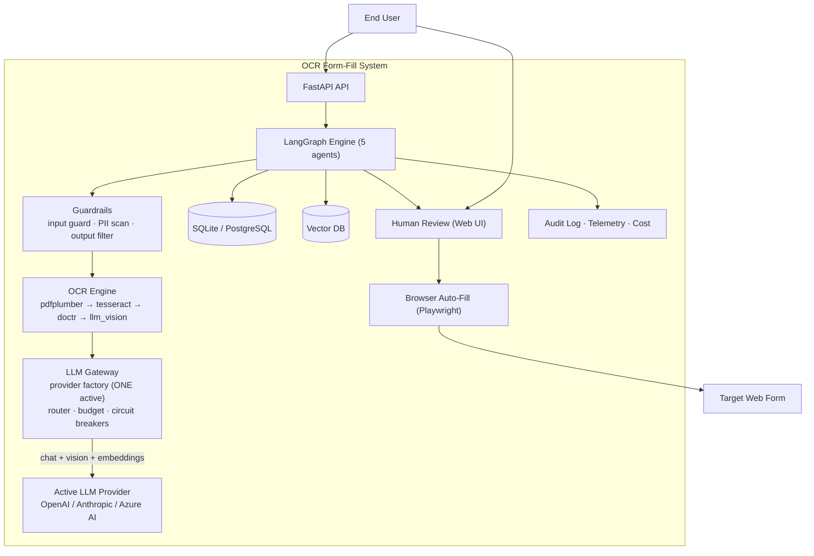

# OCR Form Fill System

Upload documents → OCR → extract fields → map to web forms → human review → auto-fill.

A FastAPI + LangGraph pipeline that turns scanned and digital documents into structured data, maps it onto web forms, and fills them — with a human-in-the-loop review step, a cost-aware LLM gateway, and guardrails at every stage.

---

## Table of Contents

- [Architecture](#architecture)
- [How It Works (Pipeline)](#how-it-works-pipeline)
- [LLM Gateway & Provider Factory](#llm-gateway--provider-factory)
- [Project Structure](#project-structure)
- [Local Setup](#local-setup)
- [Configuration](#configuration)
- [API Endpoints](#api-endpoints)
- [Running Tests](#running-tests)
- [Docker](#docker)
- [Key Features](#key-features)

---

## Architecture



### Pipeline stages

1. **Upload** — document lands in `/api/v1/sessions`; input guards validate existence, size (20 MB), magic bytes, MIME, and compute a hash for dedup/abuse tracking.
2. **Classify** — Agent 1 decides `doc_type` and picks the OCR strategy (`auto | tesseract | doctr | llm_vision | pdfplumber`).
3. **OCR chain** — a fallback chain with escalating cost/accuracy:
   - `pdfplumber` — digital PDFs (free, fast)
   - `tesseract` — scanned print (free, local)
   - `doctr` — layout-aware deep OCR (optional `[doctr]` extra)
   - `llm_vision` — last resort, routes through the LLM gateway (expensive, rare)
   - *(planned)* `textract` — AWS Textract escalation tier (gated, gated by budget)
   - Every backend returns the same contract: `{text, layout_blocks, confidence, engine, page_count}`.
4. **PII scan** — documents never reach an LLM before the PII scanner checks them (guardrail package).
5. **Extract** — Agent 2 extracts fields from the OCR text; confidence per field is tracked for the human review step.
6. **Map** — Agent 3 maps extracted fields to the target web form's inputs (semantic mapping, vector-backed).
7. **Human review** — the web UI shows extracted values + confidence; a human approves/edits before anything touches the browser.
8. **Auto-fill** — Playwright fills the target form; a safety filter blocks risky values (e.g. mismatched PII).
9. **Audit & index** — immutable audit log, telemetry, cost accounting, vector indexing for search.

### Guardrails

The `guardrail/` package is the canonical home for all security modules (renamed from `security/`; `app/safeguards/` keeps import shims for backward compatibility):

| Module | Responsibility |
|---|---|
| `input_guard.py` | File existence, size, magic bytes, MIME, hash |
| `pii_scanner.py` | PII detection before any LLM re-entry |
| `output_filter.py` | Filters LLM output for injection/undesired content |
| `prefill_safety.py` | Blocks dangerous auto-fill values |
| `abuse_detector.py` | Rate limiting / abuse patterns |
| `audit_logger.py` | Immutable audit trail |
| `data_retention.py` | GDPR retention & right-to-deletion |

## How It Works (Pipeline)

The LangGraph engine orchestrates five agents with a human-in-the-loop interrupt. A session progresses:

```
upload → input guards → classify → OCR (fallback chain) → PII scan
  → field extraction → form mapping → HUMAN REVIEW → auto-fill → audit → index
```

Sessions are cancellable, resumable, and searchable (`/api/v1/search` performs semantic vector search across processed documents).

## LLM Gateway & Provider Factory

Every LLM call goes through `app/gateway/`:

- **Provider factory (`app/gateway/adapters/factory.py`)** — exactly **one** provider is active at a time, selected by `LLM_PROVIDER` in `.env`. The factory instantiates a single adapter; switching providers is a one-line env change.
- **Supported providers:** `openai` (default) · `anthropic` · `azure` (Azure AI / Azure OpenAI — calls models by *deployment name*) · `bedrock` (reserved, adapter pending) · `google`/`local` (reserved).
- **Embeddings fallback** — if the active chat provider has no embedding model (e.g. anthropic), embeddings automatically fall back to a configured embed-capable provider (openai/azure), so vector search keeps working regardless.
- **Cost-aware router** — routes each request by capability (vision / extraction / classification / mapping / embedding) and budget tier.
- **Budget controller** — hard ceilings: daily / monthly / per-session / per-route; auto-downgrades to cheaper models at 80%, hard-stops at the ceiling.
- **Circuit breakers** — per-provider failure isolation with auto-recovery.
- **Telemetry** — per-call token/cost/latency records; cache savings tracked (L1 memory + L3 Redis).

## Project Structure

```
ocr-form-fill/
├── app/             FastAPI entry point & config (canonical: main.py, config.py, api/, web/)
├── api/             REST API v1 (re-exports from app/api/v1/)
├── agents/          LangGraph agent nodes (canonical)
├── guardrail/       Security modules — guards, PII, audit, retention (was security/)
├── components/      Reusable retrieval & ranking
├── services/        Business logic & pipelines
├── tools/           Pluggable tool definitions (OCR toolbox, validation)
├── prompts/         Versioned prompt templates + registry
├── app/gateway/     LLM gateway: factory, router, budget, cache, telemetry, adapters/
├── graph/           LangGraph orchestration (builder.py)
├── web/             Web UI (re-exports from app/web/)
├── models/          Database models
├── db/              Database setup & migrations
├── evaluation/      Golden dataset, offline eval, online monitor
├── observability/   Tracing, feedback, cost tracking
├── data/            Raw/processed/storage/index_config
├── scripts/         Seed, migrate, healthcheck
├── tests/           Unit, integration, retrieval, cache, routing
├── .env.example     Every env var, grouped and commented
└── README.md
```

## Local Setup

### Prerequisites

- **Python 3.11** (project requires `>=3.11,<3.12`)
- **Tesseract OCR** — `brew install tesseract` (macOS) / `apt install tesseract-ocr` (Debian). If your binary isn't on `PATH`, set `OCR_TESSERACT_CMD` in `.env`.

### Install

```bash
cd ocr-form-fill

# Create a virtualenv (optional but recommended)
python3.11 -m venv .venv && source .venv/bin/activate

# Install the package with dev extras
pip install -e ".[dev]"

# Optional extras (only if you need them):
pip install -e ".[doctr]"    # DocTR deep-OCR backend (pulls in torch)
pip install -e ".[aws]"      # AWS Bedrock / Textract (adapter + OCR tier, planned)

# Install Playwright browser for auto-fill
playwright install chromium
```

### Configure environment

```bash
cp .env.example .env
```

Edit `.env`:

- **Pick one LLM provider** — the factory serves exactly one at a time:
  - `LLM_PROVIDER=openai` + `OPENAI_API_KEY=sk-...` *(default)*
  - `LLM_PROVIDER=anthropic` + `ANTHROPIC_API_KEY=...`
  - `LLM_PROVIDER=azure` + `AZURE_OPENAI_API_KEY` + `AZURE_OPENAI_ENDPOINT` + the 4 `AZURE_OPENAI_DEPLOYMENT_*` names (deployments must exist in Azure AI Studio)
- Optional: `REDIS_URL`, `VECTOR_DB_TYPE`/`VECTOR_DB_URL`, budgets — see the comments in `.env.example`.

### Run

```bash
uvicorn app.main:app --reload --port 8000
```

Open **http://localhost:8000** — the web UI lets you upload a document and walk the review flow.

### Optional services

- **Redis** — multi-instance cache/session sharing: run `redis-server` (or Docker) and set `REDIS_URL=redis://localhost:6379/0`.
- **Vector DB** — the default is in-memory (`VECTOR_DB_TYPE=memory`); switch to `qdrant` or `pgvector` via `.env` for persistence.

## Configuration

All configuration lives in `app/config.py` and is overridable through `.env` (see `.env.example` for every variable, grouped and commented):

- **LLM provider selection** — `LLM_PROVIDER` (factory switch, one active)
- **Budgets** — `LLM_DAILY_BUDGET_USD` (default 25) · `LLM_MONTHLY_BUDGET_USD` (default 500) · `LLM_MAX_PER_SESSION_USD` (default 0.15)
- **OCR** — `OCR_DEFAULT_STRATEGY`, `OCR_TESSERACT_CMD`
- **Uploads / retention / admin** — size limits, retention days, `ADMIN_API_KEY`

## API Endpoints

| Method | Endpoint | Purpose |
|--------|----------|---------|
| `GET` | `/api/v1/health` | Health check |
| `POST` | `/api/v1/sessions` | Upload document (multipart) |
| `GET` | `/api/v1/sessions` | List all sessions |
| `GET` | `/api/v1/sessions/{id}` | Get session details |
| `GET` | `/api/v1/sessions/{id}/review` | Get review data |
| `POST` | `/api/v1/sessions/{id}/review` | Submit review |
| `POST` | `/api/v1/sessions/{id}/process` | Run LangGraph pipeline |
| `POST` | `/api/v1/sessions/{id}/cancel` | Cancel session |
| `DELETE` | `/api/v1/sessions/{id}` | Delete session (GDPR) |
| `GET` | `/api/v1/search` | Semantic search across documents |
| `GET` | `/api/v1/admin/gateway/status` | Gateway admin status (factory, providers, budgets) |

## Running Tests

```bash
pytest tests/ -v
```

Unit tests cover guardrails, budget, gateway cache, PII scanner, vector backends, and validation tools.

## Docker

```bash
docker compose up --build
```

The compose file runs the API plus optional services (Redis / vector DB). Copy `.env.example` → `.env` and set `LLM_PROVIDER` + your API key first.

## Key Features

- **Multi-backend OCR**: pdfplumber (digital) → Tesseract (scan) → DocTR (layout) → LLM Vision (hard cases), with an AWS Textract escalation tier planned
- **Provider factory**: one active LLM provider at a time — OpenAI / Anthropic / Azure AI — switched by a single env var, with runtime failover via the auto-switcher
- **Cost-aware LLM gateway**: per-route budget tiers, hard daily/monthly/session ceilings, circuit breakers, cache
- **Guardrails everywhere**: input validation, PII detection pre-LLM, output filtering, prefill safety, audit log, GDPR retention
- **Human-in-the-loop**: editable review UI with per-field confidence, approve/reject before any browser automation
- **Semantic search**: vector-backed retrieval across processed documents, dedup, template matching
