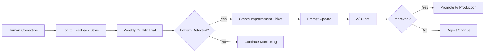

# Cross-Cutting Evaluation: Trunking, Ranking, Self-Reflection, LLM Gateway, LLMOps

**Date:** 2026-07-21
**Companion to:** `2026-07-21-ocr-form-fill-design.md`

---

## Table of Contents

1. [LLM Gateway Architecture](#1-llm-gateway-architecture)
2. [LLMOps](#2-llmops)
3. [Ranking System](#3-ranking-system)
4. [Self-Reflection & Feedback Loops](#4-self-reflection--feedback-loops)
5. [Trunking / CI/CD Strategy](#5-trunking--cicd-strategy)
6. [Budget & Cost Control Deep Dive](#6-budget--cost-control-deep-dive)
7. [Recommendations Summary](#7-recommendations-summary)

---

## 1. LLM Gateway Architecture

### Problem

The system has 5 agents + an OCR tool layer, each making LLM calls. Without a gateway, each agent directly calls LLM providers -> scattered API keys, no centralized cost control, no provider switching, no fallback, no observability.

### Architecture

```
                    +----------------------------------------------------+
                    |            LLM Gateway Service                      |
                    |                                                    |
                    |  +----------+  +----------+  +-------------------+ |
                    |  |  Cost-   |  |  Rate    |  |    Provider       | |
                    |  |  Aware   |--|  Limiter |--|    Router         | |
                    |  |  Router  |  |          |  |    (Dynamic)      | |
                    |  +----+-----+  +----------+  +--------+----------+ |
                    |       |                               |            |
                    |       |      +--------------------+   |            |
                    |       |      | Circuit Breaker    |   |            |
                    |       |      | per provider       |   |            |
                    |       |      +--------------------+   |            |
                    |       |                               |            |
                    |  +----+-------------------------------+-------+    |
                    |  |         Provider Adapters                   |    |
                    |  |                                              |    |
                    |  |  +----------+ +----------+ +----------+     |    |
                    |  |  | OpenAI   | | Claude   | | Gemini   |     |    |
                    |  |  | (Direct) | | (Direct) | | (Vertex) |     |    |
                    |  |  +----------+ +----------+ +----------+     |    |
                    |  |  +----------+ +----------+ +----------+     |    |
                    |  |  | Azure    | | AWS      | | Local     |    |    |
                    |  |  | OpenAI   | | Bedrock  | | (Ollama/  |    |    |
                    |  |  |          | |          | |  vLLM)   |    |    |
                    |  |  +----------+ +----------+ +----------+     |    |
                    |  +----------------------------------------------+    |
                    |                                                    |
                    |  +----------------------------------------------+ |
                    |  |  Observability & Cost Control Layer           | |
                    |  |  (tokens, cost, latency, budget, alerts)     | |
                    |  +----------------------------------------------+ |
                    +----------------------------------------------------+
                              |              ^
                              v              |
                    +------------------------------------------+
                    |  LangChain Agent Runtime                   |
                    |  (5 agents via GatewayCallback)            |
                    +------------------------------------------+
```

---

### 1.1 Provider Registry (Dynamic Switching)

Providers are registered at startup via config, not hardcoded. You can add/remove/reorder providers via config change or API, with zero code changes.

```python
# config.yaml -- providers can be enabled/disabled at runtime
llm_gateway:
  switching_strategy: "cost_optimized"   # Global default; overridable per route

  providers:
    openai:
      enabled: true
      priority: 1
      models:
        - id: gpt-4o
          capabilities: [vision, extraction, classification]
          cost_per_1k_input: 0.005
          cost_per_1k_output: 0.015
        - id: gpt-4o-mini
          capabilities: [classification, mapping]
          cost_per_1k_input: 0.00015
          cost_per_1k_output: 0.0006

    anthropic:
      enabled: true
      priority: 2
      models:
        - id: claude-sonnet-4-20250514
          capabilities: [vision, extraction, classification]
          cost_per_1k_input: 0.003
          cost_per_1k_output: 0.015
        - id: claude-haiku-4-20251001
          capabilities: [classification, mapping]
          cost_per_1k_input: 0.00025
          cost_per_1k_output: 0.00125

    google:
      enabled: false          # Toggle at runtime via admin API
      priority: 3
      models:
        - id: gemini-2.5-pro
          capabilities: [vision, extraction]
          cost_per_1k_input: 0.00125
          cost_per_1k_output: 0.005

    local:
      enabled: false
      priority: 4
      models:
        - id: llama-3-70b
          capabilities: [classification, mapping]
          cost_per_1k_input: 0.0001
          cost_per_1k_output: 0.0001
```

```python
class ProviderRegistry:
    """
    Central registry of all LLM providers and models.
    Supports hot-swap: providers can be enabled/disabled at runtime
    via API endpoint without restart.
    """

    def __init__(self, config_path: str):
        self.config = self._load_config(config_path)
        self._circuit_breakers: dict[str, CircuitBreaker] = {}
        self._health: dict[str, ProviderHealth] = {}

    def get_available_models(self, capability: str, budget_tier: str = "any") -> list[ModelInfo]:
        """
        Return models that support a capability, sorted by strategy:
        - budget_tier="cheapest": lowest cost first
        - budget_tier="best": highest capability first (by priority)
        - budget_tier="any": priority ordering from config
        """
        candidates = []
        for prov_name, prov_cfg in self.config["providers"].items():
            if not prov_cfg["enabled"]:
                continue
            cb = self._circuit_breakers.get(prov_name)
            if cb and cb.is_open():
                continue  # Skip providers in circuit-breaker open state

            for model in prov_cfg["models"]:
                if capability in model["capabilities"]:
                    candidates.append(ModelInfo(
                        provider=prov_name,
                        model_id=model["id"],
                        priority=prov_cfg["priority"],
                        cost_input=model["cost_per_1k_input"],
                        cost_output=model["cost_per_1k_output"],
                    ))

        # Sort by budget tier
        if budget_tier == "cheapest":
            candidates.sort(key=lambda m: m.cost_input + m.cost_output)
        elif budget_tier == "best":
            candidates.sort(key=lambda m: m.priority)
        else:
            candidates.sort(key=lambda m: (m.priority, m.cost_input))

        return candidates

    def switch_provider_state(self, provider_name: str, enabled: bool):
        """Hot-swap: enable/disable a provider at runtime via admin API."""
        self.config["providers"][provider_name]["enabled"] = enabled
        log(f"Provider {provider_name} {'enabled' if enabled else 'disabled'} at runtime")

    def get_provider_stats(self) -> dict:
        """Return health, circuit breaker state, and costs for all providers."""
        return {
            name: {
                "enabled": cfg["enabled"],
                "circuit_breaker": (
                    self._circuit_breakers.get(name).state
                    if self._circuit_breakers.get(name) else "closed"
                ),
                "health": self._health.get(name, {}),
                "models": [m["id"] for m in cfg["models"]],
            }
            for name, cfg in self.config["providers"].items()
        }
```

---

### 1.2 Switching Strategies

The gateway supports **four switching strategies**, configurable globally or per route:

```python
SWITCHING_STRATEGIES = {
    "cost_optimized": {
        "description": "Always pick the cheapest model capable of the task",
        "suitable_for": ["doc_classification", "semantic_mapping", "form_analysis"],
        "default_tier": "cheapest",
    },
    "quality_optimized": {
        "description": "Always pick the most capable model regardless of cost",
        "suitable_for": ["vision_ocr", "field_extraction"],
        "default_tier": "best",
    },
    "balanced": {
        "description": "Use best model by default; downgrade to cheapest when budget is tight",
        "suitable_for": ["default"],
        "default_tier": "best",
    },
    "manual": {
        "description": "Admin explicitly pins provider:model per route",
        "suitable_for": ["debugging", "controlled experiments"],
        "default_tier": "manual",
    },
}
```

**How the strategy affects routing behavior:**

```python
class CostAwareRouter:
    """
    Routes every LLM call to the optimal provider/model based on:
    1. Required capability (vision, extraction, classification, mapping)
    2. Switching strategy (cost_optimized | quality_optimized | balanced | manual)
    3. Current budget state (session remaining, daily remaining)
    4. Real-time provider health (latency, error rate, circuit breaker state)
    """

    def __init__(self, registry: ProviderRegistry, budget: BudgetController):
        self.registry = registry
        self.budget = budget
        self.manual_overrides: dict[str, RouteOverride] = {}  # Per-route overrides

    async def resolve_route(self, request: LLMRequest) -> RouteDecision:
        # 1. Check manual override first
        route_override = self.manual_overrides.get(request.route_key)
        if route_override:
            return RouteDecision(
                provider=route_override.provider,
                model=route_override.model,
                estimated_cost=0,
                budget_tier_used="manual_override",
            )

        # 2. Determine budget tier based on strategy + remaining budget
        strategy = request.switching_strategy or "balanced"
        budget_tier = self._select_budget_tier(
            strategy, request, self.budget.session_remaining(request.session_id)
        )

        # 3. Get available models
        candidates = self.registry.get_available_models(
            capability=request.capability,
            budget_tier=budget_tier,
        )

        # 4. Try candidates in order, respecting circuit breakers
        for model in candidates:
            estimated_cost = self._estimate_cost(model, request.estimated_tokens)

            if self.budget.would_exceed_budget(
                model.provider, estimated_cost, request.session_id
            ):
                continue

            cb = self.registry._circuit_breakers.get(model.provider)
            if cb and cb.is_open():
                continue

            return RouteDecision(
                provider=model.provider,
                model=model.model_id,
                estimated_cost=estimated_cost,
                budget_tier_used=budget_tier,
            )

        # 5. Last resort: try ANY provider even if over budget
        for model in candidates:
            cb = self.registry._circuit_breakers.get(model.provider)
            if cb and cb.is_open():
                continue
            return RouteDecision(
                provider=model.provider,
                model=model.model_id,
                estimated_cost=self._estimate_cost(model, request.estimated_tokens),
                budget_tier_used="over_budget",
            )

        raise NoAvailableProvider(f"No provider available for {request.route_key}")

    def _select_budget_tier(self, strategy: str, request: LLMRequest, session_remaining: float) -> str:
        """Select budget tier based on strategy and remaining session budget."""
        if strategy == "cost_optimized":
            return "cheapest"

        if strategy == "quality_optimized":
            return "best"

        if strategy == "balanced":
            estimated_cost = request.estimated_tokens * 0.01 / 1000
            if session_remaining < estimated_cost * 5:
                return "cheapest"  # Budget running low -- downgrade
            return "best"          # Budget healthy -- use best model

        return "best"
```

---

### 1.3 Automatic Provider Switching Triggers

The gateway monitors conditions and auto-switches providers without human intervention:

```python
class AutoSwitcher:
    """
    Monitors real-time conditions and auto-switches provider routes.
    Each rule has a cooldown to prevent thrashing.
    """

    SWITCH_RULES = [
        {
            "name": "budget_downgrade",
            "description": "When daily budget exceeds 80%, downgrade all non-critical routes to cheapest",
            "condition": lambda ctx: ctx.daily_usage_pct > 80,
            "action": "set_strategy",
            "target": "cost_optimized",
            "scope": "non_critical_routes",  # classification, mapping, form analysis
            "cooldown_minutes": 30,
        },
        {
            "name": "budget_critical",
            "description": "When daily budget exceeds 95%, downgrade EVERYTHING to cheapest",
            "condition": lambda ctx: ctx.daily_usage_pct > 95,
            "action": "set_strategy",
            "target": "cost_optimized",
            "scope": "all_routes",
            "cooldown_minutes": 15,
        },
        {
            "name": "provider_outage",
            "description": "When a provider has > 10% error rate, route all traffic elsewhere",
            "condition": lambda ctx: ctx.provider_error_rate("openai") > 0.10,
            "action": "disable_provider",
            "target": "openai",
            "cooldown_minutes": 5,  # Check again in 5 minutes
        },
        {
            "name": "provider_recovery",
            "description": "Re-enable a provider after it has been healthy for 10+ minutes",
            "condition": lambda ctx: (
                ctx.minutes_since_disable("openai") > 10
                and ctx.provider_error_rate("openai", window_minutes=2) < 0.01
            ),
            "action": "enable_provider",
            "target": "openai",
        },
        {
            "name": "latency_degradation",
            "description": "When p95 latency exceeds 10s, reduce that provider's priority",
            "condition": lambda ctx: ctx.provider_p95_latency("anthropic") > 10000,
            "action": "reduce_priority",
            "target": "anthropic",
            "cooldown_minutes": 10,
        },
        {
            "name": "weekend_economy",
            "description": "On weekends when traffic is low, use cheapest models everywhere",
            "condition": lambda ctx: ctx.current_day in ("Saturday", "Sunday"),
            "action": "set_strategy",
            "target": "cost_optimized",
            "scope": "all_routes",
        },
        {
            "name": "cost_spike_protection",
            "description": "If avg cost per session spikes > 20% compared to 7-day rolling average",
            "condition": lambda ctx: (
                ctx.avg_cost_per_session_last_hour
                > ctx.avg_cost_per_session_7d * 1.20
            ),
            "action": "set_strategy",
            "target": "cost_optimized",
            "scope": "all_routes",
            "cooldown_minutes": 60,
        },
    ]

    async def evaluate(self, context: SystemContext) -> list[SwitchAction]:
        """Evaluate all rules and return the actions to execute."""
        actions = []
        for rule in self.SWITCH_RULES:
            if self._in_cooldown(rule):
                continue
            try:
                if rule["condition"](context):
                    actions.append(SwitchAction(
                        rule=rule["name"],
                        action=rule["action"],
                        target=rule["target"],
                        scope=rule.get("scope", "all_routes"),
                    ))
                    self._set_cooldown(rule)
            except Exception as e:
                log(f"AutoSwitcher rule {rule['name']} failed: {e}")
        return actions
```

---

### 1.4 Circuit Breaker Per Provider

Prevents cascading failures when a provider is degraded:

```python
class CircuitBreakerState(Enum):
    CLOSED = "closed"       # Normal operation
    OPEN = "open"           # Failing -- no requests allowed
    HALF_OPEN = "half_open" # Testing -- allow one trial request

class CircuitBreaker:
    """
    State machine per provider+model:
    CLOSED -> OPEN (on threshold failures) -> HALF_OPEN (after timeout) -> CLOSED or OPEN
    """

    def __init__(self, failure_threshold: int = 5, recovery_timeout_s: int = 60):
        self.failure_count = 0
        self.failure_threshold = failure_threshold
        self.recovery_timeout = recovery_timeout_s
        self.last_failure_time = 0.0
        self.state = CircuitBreakerState.CLOSED

    def record_success(self):
        self.failure_count = 0
        if self.state == CircuitBreakerState.HALF_OPEN:
            self.state = CircuitBreakerState.CLOSED
            log("Circuit breaker recovered: CLOSED")

    def record_failure(self):
        self.failure_count += 1
        self.last_failure_time = time.monotonic()
        if self.failure_count >= self.failure_threshold:
            self.state = CircuitBreakerState.OPEN
            alert(f"Circuit breaker OPEN: {self.failure_count} consecutive failures")

    def is_open(self) -> bool:
        if self.state == CircuitBreakerState.OPEN:
            if time.monotonic() - self.last_failure_time > self.recovery_timeout:
                self.state = CircuitBreakerState.HALF_OPEN
                return False  # Allow one trial request
            return True
        return False
```

---

### 1.5 Manual Provider Override API

For operational control when you need to pin a specific provider:

```python
@router.post("/api/v1/admin/gateway/override")
async def set_route_override(override: RouteOverride):
    """
    Force all calls for a route to a specific provider+model.
    Set both to null to clear and return to auto-routing.
    """
    if override.route and override.provider:
        router.set_manual_override(override.route, override.provider, override.model)
        return {
            "status": "override_set",
            "route": override.route,
            "provider": override.provider,
            "model": override.model,
        }
    else:
        router.clear_manual_override(override.route)
        return {"status": "auto_routing_restored", "route": override.route}


@router.delete("/api/v1/admin/gateway/override/{route}")
async def clear_route_override(route: str):
    """Clear manual override, return to cost-aware auto-routing."""
    router.clear_manual_override(route)
    return {"status": "auto_routing_restored", "route": route}


@router.post("/api/v1/admin/gateway/toggle-provider")
async def toggle_provider(toggle: ProviderToggle):
    """Enable or disable an entire provider at runtime."""
    registry.switch_provider_state(toggle.provider_name, toggle.enabled)
    action = "enabled" if toggle.enabled else "disabled"
    alert(f"Provider {toggle.provider_name} {action} by admin")
    return {"status": f"provider_{action}", "provider": toggle.provider_name}


@router.post("/api/v1/admin/gateway/strategy")
async def set_switching_strategy(strategy: StrategyOverride):
    """Override the switching strategy globally or per route."""
    if strategy.route:
        router.set_route_strategy(strategy.route, strategy.strategy)
    else:
        router.set_global_strategy(strategy.strategy)
    return {
        "status": f"strategy_set_to_{strategy.strategy}",
        "route": strategy.route or "global",
    }


@router.get("/api/v1/admin/gateway/status")
async def gateway_status():
    """Full gateway status dashboard data."""
    return {
        "routing_table": router.get_active_routes(),
        "overrides": router.get_active_overrides(),
        "circuit_breakers": {
            name: cb.state.value for name, cb in registry._circuit_breakers.items()
        },
        "provider_health": registry.get_provider_stats(),
        "budget": budget_controller.current_budget_status(),
        "active_strategies": router.get_active_strategies(),
    }
```

---

### 1.6 Provider Adapters (Pluggable)

Each provider implements a common interface, making switching transparent:

```python
class LLMProviderAdapter(ABC):
    """Abstract base for all LLM provider adapters."""

    @abstractmethod
    async def invoke(self, request: GatewayRequest) -> GatewayResponse:
        ...

    @abstractmethod
    async def check_health(self) -> ProviderHealth:
        ...


class OpenAIAdapter(LLMProviderAdapter):
    """OpenAI Direct + Azure OpenAI support."""

    def __init__(self, config: dict):
        self.api_type = config.get("api_type", "openai")  # "openai" or "azure"
        if self.api_type == "azure":
            self.client = AsyncAzureOpenAI(**config["azure_params"])
        else:
            self.client = AsyncOpenAI(api_key=config["api_key"])

    async def invoke(self, request: GatewayRequest) -> GatewayResponse:
        response = await self.client.chat.completions.create(
            model=request.model,
            messages=request.messages,
            max_tokens=request.max_tokens,
            temperature=request.temperature,
        )
        return GatewayResponse(
            content=response.choices[0].message.content,
            usage=response.usage,
            provider="openai",
            model=request.model,
        )


class AnthropicAdapter(LLMProviderAdapter):
    """Anthropic Direct + AWS Bedrock support."""

    def __init__(self, config: dict):
        self.api_type = config.get("api_type", "direct")
        if self.api_type == "bedrock":
            self.client = AnthropicBedrock(**config["aws_params"])
        else:
            self.client = AsyncAnthropic(api_key=config["api_key"])

    async def invoke(self, request: GatewayRequest) -> GatewayResponse:
        response = await self.client.messages.create(
            model=request.model,
            messages=request.messages,
            max_tokens=request.max_tokens,
            temperature=request.temperature,
        )
        return GatewayResponse(
            content=response.content[0].text,
            usage=response.usage,
            provider="anthropic",
            model=request.model,
        )


class LocalAdapter(LLMProviderAdapter):
    """Ollama / vLLM / custom local endpoint."""

    def __init__(self, config: dict):
        self.endpoint = config["endpoint"]  # e.g. "http://localhost:11434"
        self.default_model = config.get("default_model", "llama3")

    async def invoke(self, request: GatewayRequest) -> GatewayResponse:
        async with httpx.AsyncClient() as client:
            response = await client.post(
                f"{self.endpoint}/v1/chat/completions",
                json={
                    "model": request.model or self.default_model,
                    "messages": request.messages,
                    "max_tokens": request.max_tokens,
                    "temperature": request.temperature,
                },
            )
            data = response.json()
            return GatewayResponse(
                content=data["choices"][0]["message"]["content"],
                usage=data.get("usage", {}),
                provider="local",
                model=request.model or self.default_model,
            )
```

---

### 1.7 Response Caching (Cost Savings)

Idempotent calls are cached to reduce cost:

```python
CACHE_RULES = {
    "doc_classification":  {"ttl_s": 3600, "exact_match": True},
    "form_analysis":       {"ttl_s": 1800, "exact_match": True},
    "semantic_mapping":    {"ttl_s": 600,  "exact_match": True},
    "field_extraction":    {"ttl_s": 0,    "exact_match": False},  # Never cache -- values differ per doc
    "vision_ocr":          {"ttl_s": 0,    "exact_match": False},  # Never cache OCR
}
```

Cache hit rate and savings are reported in the cost dashboard.

---

### 1.8 Rate Limiting (Cost-Aware)

```python
class CostAwareRateLimiter:
    """
    Rate limiter that considers both token limits AND cost budgets.
    Cheap requests are accepted more freely than expensive vision calls.
    """

    RATE_LIMITS = {
        "openai":    {"tpm": 200_000,  "rpm": 500,  "concurrent": 10},
        "anthropic": {"tpm": 100_000,  "rpm": 200,  "concurrent": 5},
        "google":    {"tpm": 50_000,   "rpm": 100,  "concurrent": 3},
        "local":     {"tpm": 1_000_000,"rpm": 1000, "concurrent": 20},
    }

    def __init__(self, budget_controller):
        self.buckets = {
            p: TokenBucket(limits["tpm"], limits["rpm"])
            for p, limits in self.RATE_LIMITS.items()
        }
        self.budget = budget_controller

    async def acquire(self, provider: str, estimated_cost: float,
                      session_id: str, priority: str) -> bool:
        # 1. Check token/request bucket
        if not self.buckets[provider].try_consume():
            return False

        # 2. Budget-aware gating: protect remaining budget for high-priority calls
        if priority != "high" and estimated_cost > 0.02:
            if self.budget.daily_remaining() < 5.0:
                return False  # Reserve budget for important calls

        return True
```

---

### 1.9 Gateway in Project Structure

```
ocr/app/
+-- gateway/
|   +-- __init__.py
|   +-- router.py                # CostAwareRouter -- dynamic route resolution
|   +-- registry.py              # ProviderRegistry -- all providers + models
|   +-- auto_switcher.py         # AutoSwitcher -- automatic provider switching rules
|   +-- circuit_breaker.py       # CircuitBreaker per provider+model
|   +-- rate_limiter.py          # CostAwareRateLimiter
|   +-- cache.py                 # Response cache (Redis / local)
|   +-- budget.py                # BudgetController -- all budget logic
|   +-- telemetry.py             # CostTracker + LLM call logging
|   +-- admin_api.py             # Admin override + switching endpoints
|   +-- adapters/
|   |   +-- __init__.py
|   |   +-- base.py              # LLMProviderAdapter (ABC)
|   |   +-- openai_adapter.py    # OpenAI Direct + Azure OpenAI
|   |   +-- anthropic_adapter.py # Anthropic Direct + AWS Bedrock
|   |   +-- google_adapter.py    # Google Vertex AI
|   |   +-- local_adapter.py     # Ollama / vLLM / custom endpoint
|   +-- structured_output.py     # Shared Pydantic schemas for structured mode
```

---

## 2. LLMOps

### 2.1 LLM Call Observability

Every LLM call through the gateway emits telemetry:

```python
LLM_TELEMETRY_SCHEMA = {
    "timestamp":        "ISO 8601",
    "session_id":       "UUID",
    "agent":            "document_analyzer | field_extractor | ...",
    "route_key":        "vision_ocr | field_extraction | ...",
    "switching_strategy": "cost_optimized | balanced | quality_optimized | manual",
    "provider":         "openai | anthropic",
    "model":            "gpt-4o | claude-sonnet-4-20250514",
    "tokens_in":        int,
    "tokens_out":       int,
    "cost_usd":         float,
    "latency_ms":       float,
    "success":          bool,
    "error":            "str | null",
    "cached":           bool,
    "retry_attempt":    int,
    "budget_tier":      "cheapest | best | over_budget",
}
```

Stored in:
- **Development:** SQLite table `llm_telemetry`
- **Production:** Prometheus counters + Grafana dashboard + structured JSON logs

### 2.2 Prompt Versioning & Management

Each agent's system prompt is versioned and stored as a YAML file:

```
ocr/app/graph/agents/prompts/
+-- document_analyzer/
|   +-- v1.0.0.yaml           # Initial version
|   +-- v1.1.0.yaml           # Added PDF classification
|   +-- CHANGELOG.md
+-- field_extractor/
|   +-- v1.0.0.yaml
|   +-- v1.1.0.yaml           # Added currency normalization
+-- form_analyzer/
|   +-- v1.0.0.yaml
|   +-- v1.0.1.yaml           # Fixed multi-form detection
+-- field_mapper/
|   +-- v1.0.0.yaml
|   +-- v1.1.0.yaml           # Added group matching
+-- form_filler/
    +-- v1.0.0.yaml
    +-- CHANGELOG.md
```

Each prompt file:

```yaml
# prompts/document_analyzer/v1.1.0.yaml
version: "1.1.0"
date: "2026-07-21"
author: "system"
change: "Added digital_pdf classification for pdfplumber routing"

system_prompt: |
  You are a Document Analyzer for the OCR Form Fill system...

route_key: "doc_classification"
switching_strategy: "cost_optimized"   # This route should always use cheapest model

tests:
  - input: "sample_invoice.pdf"
    expected_classification: "invoice"
    passes: true
```

### 2.3 Quality Evaluation Pipeline

A periodic evaluation pipeline that measures extraction quality:

```python
class QualityEvaluator:
    """Evaluates LLM extraction quality against ground truth."""

    EVAL_METRICS = {
        "field_accuracy":       "What % of extracted field values exactly match human-verified values?",
        "field_completeness":   "What % of expected fields were extracted at all?",
        "mapping_accuracy":     "What % of field-to-form mappings were correct?",
        "human_correction_rate": "What % of sessions needed human corrections?",
        "avg_confidence":       "Mean confidence score across all extractions",
        "cost_per_session":     "Mean LLM cost per completed session",
        "latency_p95":          "95th percentile end-to-end processing time",
    }

    def evaluate_batch(self, sessions: list[str]) -> dict:
        """
        Compare extracted_fields against human_corrections from review.
        Called weekly or after N sessions per document type.
        """
        results = {"by_doc_type": {}, "overall": []}
        for session_id in sessions:
            session = load_session(session_id)
            doc_type = session["doc_type"]
            extracted = session["extracted_fields"]
            corrections = session.get("human_corrections", {})

            for field, data in extracted.items():
                ground_truth = corrections.get(field, data["value"])
                match = data["value"] == ground_truth
                results["by_doc_type"].setdefault(doc_type, []).append(match)
                results["overall"].append(match)

        return {
            "overall_accuracy": mean(results["overall"]),
            "by_doc_type": {k: mean(v) for k, v in results["by_doc_type"].items()},
            "sample_size": len(sessions),
        }
```

### 2.4 Drift Detection

```python
DRIFT_MONITORS = {
    "confidence_drift": {
        "metric": "avg_confidence_score",
        "window": "7d",
        "threshold": "drop > 0.05",
        "action": "alert_llmops_team",
    },
    "correction_drift": {
        "metric": "human_correction_rate",
        "window": "7d",
        "threshold": "increase > 10%",
        "action": "flag_doc_type_for_review",
    },
    "cost_drift": {
        "metric": "avg_cost_per_session",
        "window": "30d",
        "threshold": "increase > 20%",
        "action": "review_prompt_efficiency | switch provider strategy",
    },
    "latency_drift": {
        "metric": "p95_latency_ms",
        "window": "7d",
        "threshold": "increase > 30%",
        "action": "check_provider_health",
    },
    "provider_quality_drift": {
        "metric": "extraction_accuracy_by_provider",
        "window": "14d",
        "threshold": "accuracy gap between providers > 5%",
        "action": "rebalance routing weights",
    },
}
```

### 2.5 Prompt A/B Testing Framework

```python
PROMPT_EXPERIMENTS = {
    "field_extractor_v1_vs_v2": {
        "description": "Test structured output schema change for field extractor",
        "start_date": "2026-08-01",
        "traffic_split": {"v1.0.0": 50, "v1.1.0": 50},
        "metrics": ["field_accuracy", "human_correction_rate", "latency"],
        "min_sample": 100,
        "status": "running",
    }
}

PROVIDER_A_B_TESTS = {
    "extraction_openai_vs_anthropic": {
        "description": "Compare extraction quality between GPT-4o and Claude Sonnet",
        "start_date": "2026-08-15",
        "traffic_split": {"openai/gpt-4o": 50, "anthropic/claude-sonnet-4-20250514": 50},
        "metrics": ["field_accuracy", "human_correction_rate", "cost_per_session", "latency"],
        "min_sample": 200,
        "auto_promote": True,  # Auto-route to better provider after threshold
    }
}
```

### 2.6 LLMOps Dashboard (Grafana)

Key panels:

| Panel | Source | Purpose |
|-------|--------|---------|
| **Calls/min per provider** | LLM telemetry | Provider health |
| **Avg cost/session** | Cost tracker | Budget tracking |
| **P95 latency per route** | LLM telemetry | Performance monitoring |
| **Token usage per agent** | LLM telemetry | Which agent consumes most |
| **Human correction rate (7d)** | Session DB | Quality trending |
| **Avg confidence score (7d)** | Session DB | Drift detection |
| **Provider error rate** | LLM telemetry | Failure monitoring |
| **Cache hit rate** | Gateway cache | Cost efficiency |
| **Auto-switch events** | AutoSwitcher | Switching activity log |
| **Budget utilization** | Budget controller | How much of daily/monthly budget used |

### 2.7 Cost Reporting

```python
class CostReporter:
    """Generates cost reports at multiple granularities."""

    def session_report(self, session_id: str) -> dict:
        return {
            "session_id": session_id,
            "total_cost": cost_tracker.session_cost(session_id),
            "by_agent": self._cost_by_agent(session_id),
            "by_provider": self._cost_by_provider(session_id),
            "by_route": self._cost_by_route(session_id),
            "cache_savings": cost_tracker.cache_savings_for_session(session_id),
            "calls": cost_tracker.calls_for_session(session_id),
        }

    def daily_report(self) -> dict:
        return {
            "date": date.today().isoformat(),
            "total_cost": round(cost_tracker.daily_cost, 4),
            "budget_remaining": round(budget_controller.daily_remaining(), 4),
            "cache_savings": round(cost_tracker.cache_savings, 4),
            "effective_cost": round(max(cost_tracker.daily_cost - cost_tracker.cache_savings, 0), 4),
            "by_provider": self._aggregate_by_provider(),
            "by_route": self._aggregate_by_route(),
            "by_doc_type": self._aggregate_by_doc_type(),
            "total_calls": cost_tracker.total_calls(),
            "avg_cost_per_call": round(cost_tracker.avg_cost_per_call(), 6),
            "p95_latency_ms": cost_tracker.p95_latency(),
        }

    def weekly_trend(self) -> dict:
        """7-day rolling trend for cost, accuracy, and latency."""
        return {
            "cost_trend": self._rolling_avg("cost_usd", 7),
            "accuracy_trend": self._rolling_avg("field_accuracy", 7),
            "latency_trend": self._rolling_avg("latency_ms", 7),
            "provider_usage_share": self._provider_share_7d(),
        }
```

---

## 3. Ranking System

### 3.1 Field Extraction Confidence (Per-Field)

Every extracted field carries a multi-factor confidence score:

```python
@dataclass
class FieldConfidence:
    """Composite confidence for a single extracted field."""
    value: Any
    ocr_confidence: float        # 0.0-1.0 from OCR engine
    extraction_confidence: float  # 0.0-1.0 from LLM extraction
    format_validity: float        # 0.0-1.0 -- did the value pass format validation?
    field_level: float            # 1.0 = exact label match, 0.7 = inferred field

    @property
    def composite(self) -> float:
        """Weighted geometric mean of all confidence factors."""
        weights = {"ocr": 0.3, "extraction": 0.4, "format": 0.2, "level": 0.1}
        return (
            self.ocr_confidence ** weights["ocr"] *
            self.extraction_confidence ** weights["extraction"] *
            self.format_validity ** weights["format"] *
            self.field_level ** weights["level"]
        )

    @property
    def tier(self) -> str:
        """Decision tier based on composite score."""
        if self.composite >= 0.90:   return "auto_accept"
        if self.composite >= 0.70:   return "review"
        if self.composite >= 0.40:   return "flag_human"
        return "unreliable"
```

### 3.2 Form Field Match Ranking

```python
@dataclass
class FormMatchCandidate:
    form_field_id: str
    similarity_score: float       # 0.0-1.0 semantic similarity
    label_match_type: str         # "exact" | "semantic" | "format" | "group" | "fallback"
    format_compatibility: float   # 0.0-1.0 -- does the extracted value match expected format?
    position_proximity: float     # 0.0-1.0 -- if fields have spatial relationship in the form

    @property
    def rank_score(self) -> float:
        """Weighted score for ranking matching candidates."""
        weights = {"similarity": 0.5, "format": 0.3, "position": 0.1, "type": 0.1}
        type_bonus = {"exact": 1.0, "semantic": 0.8, "format": 0.6, "group": 0.5, "fallback": 0.3}
        return (
            self.similarity_score * weights["similarity"] +
            self.format_compatibility * weights["format"] +
            self.position_proximity * weights["position"] +
            type_bonus.get(self.label_match_type, 0) * weights["type"]
        )
```

### 3.3 Session-Level Ranking

```python
@dataclass
class SessionQualityScore:
    """Overall quality assessment of a processing session."""
    session_id: str
    avg_field_confidence: float    # Mean composite across all fields
    mapping_coverage: float        # % of extracted fields successfully mapped
    human_correction_count: int    # How many fields the user had to correct
    ocr_engine_used: str           # Primary OCR engine for this session
    num_fallbacks: int             # How many times the OCR fallback chain was used
    total_cost_usd: float          # Total LLM cost for this session

    @property
    def quality_tier(self) -> str:
        score = (
            self.avg_field_confidence * 0.4 +
            self.mapping_coverage * 0.3 +
            (1 - min(self.human_correction_count / 10, 1)) * 0.2 +
            (1 - min(self.num_fallbacks / 3, 1)) * 0.1
        )
        if score >= 0.85: return "excellent"
        if score >= 0.70: return "good"
        if score >= 0.50: return "fair"
        return "poor"

    @property
    def cost_efficiency(self) -> str:
        """Cost efficiency relative to quality."""
        if self.total_cost_usd <= 0.10: return "efficient"
        if self.total_cost_usd <= 0.30: return "reasonable"
        if self.total_cost_usd <= 0.50: return "expensive"
        return "over_budget"
```

### 3.4 OCR Backend Ranking (System Intelligence)

The system tracks which OCR backend performs best per document type:

```python
OCR_BACKEND_RANKING = {
    "invoice": {
        "tesseract":  {"avg_confidence": 0.82, "avg_cost_per_page": 0.001, "sessions": 120},
        "doctr":      {"avg_confidence": 0.93, "avg_cost_per_page": 0.003, "sessions": 95},
        "llm_vision": {"avg_confidence": 0.96, "avg_cost_per_page": 0.030, "sessions": 30},
        "recommended": "doctr",         # Best cost-adjusted accuracy
        "cost_optimized": "tesseract",  # Cheapest acceptable option
    },
    "handwritten_note": {
        "tesseract":  {"avg_confidence": 0.35, "avg_cost_per_page": 0.001, "sessions": 20},
        "doctr":      {"avg_confidence": 0.45, "avg_cost_per_page": 0.003, "sessions": 15},
        "llm_vision": {"avg_confidence": 0.91, "avg_cost_per_page": 0.030, "sessions": 40},
        "recommended": "llm_vision",
    },
}
```

### 3.5 Decision Thresholds (Where Ranking Drives Behavior)

| Composite Score | Field Tier | Auto-Fill? | Human Review? | Mapping Allowed? |
|----------------|-----------|-----------|---------------|-----------------|
| >= 0.90 | auto_accept | Yes | Optional | Auto-mapped |
| 0.70 - 0.89 | review | Only if explicit | Required | Show for confirmation |
| 0.40 - 0.69 | flag_human | No | Required | Manual mapping needed |
| < 0.40 | unreliable | No | Re-extraction recommended | Flag as problematic |

---

## 4. Self-Reflection & Feedback Loops

### 4.1 Human Feedback Capture

```python
FEEDBACK_TYPES = {
    "value_correction": {
        "description": "Human corrected an extracted field value",
        "captures": ["field_key", "original_value", "corrected_value", "document_type"],
        "action": "log into quality evaluation pipeline",
    },
    "mapping_correction": {
        "description": "Human manually mapped an unmapped field",
        "captures": ["field_key", "extracted_value", "chosen_form_field", "document_type"],
        "action": "log and update semantic matching hints",
    },
    "mapping_rejection": {
        "description": "Human rejected an auto-mapping as wrong",
        "captures": ["field_key", "proposed_mapping", "correct_mapping", "document_type"],
        "action": "log and reduce confidence for similar patterns",
    },
    "session_rejection": {
        "description": "Human rejected the entire session",
        "captures": ["session_id", "reason", "document_type"],
        "action": "log and flag document type for investigation",
    },
}
```

### 4.2 Automated Self-Evaluation

After each session completes, the system runs a self-evaluation:

```python
class SelfEvaluator:
    """Post-session self-evaluation that populates quality and cost metrics."""

    def evaluate(self, state: OCRFormFillState) -> dict:
        findings = []

        # 1. Did any fallbacks fire?
        if state.get("ocr_fallback_used"):
            findings.append({
                "type": "warning",
                "message": f"OCR fallback chain was used: {state['ocr_fallback_reason']}",
                "suggestion": "Consider upgrading source document quality",
            })

        # 2. What was the human correction rate?
        field_count = len(state.get("extracted_fields", {}))
        correction_count = len(state.get("human_corrections", {}))
        if field_count > 0 and correction_count / field_count > 0.3:
            findings.append({
                "type": "degradation",
                "message": f"High correction rate: {correction_count}/{field_count} fields corrected",
                "suggestion": "Flag document type for extraction prompt review",
            })

        # 3. Was mapping coverage low?
        mapped = len(state.get("field_mappings", {}))
        unmapped = len(state.get("unmapped_fields", []))
        total = mapped + unmapped
        if total > 0 and unmapped / total > 0.2:
            findings.append({
                "type": "warning",
                "message": f"Low mapping coverage: {mapped}/{total} fields mapped",
                "suggestion": "Review form field labels or add form schema cache entry",
            })

        # 4. Was the target URL valid?
        if state.get("fill_status") == "failed" and state.get("target_url"):
            findings.append({
                "type": "error",
                "message": f"Form fill failed for {state['target_url']}",
                "suggestion": "Verify URL is accessible and form is functional",
            })

        # 5. Cost efficiency
        session_cost = cost_tracker.session_cost(state["session_id"])
        if session_cost > 0.50:
            findings.append({
                "type": "cost_warning",
                "message": f"High session cost: ${session_cost:.2f}",
                "suggestion": "Consider using cheaper model or switching provider strategy",
            })

        return {"findings": findings, "quality_score": self._compute_quality(findings)}
```

### 4.3 Weekly Quality & Cost Report

```python
WEEKLY_QUALITY_REPORT = {
    "period": "2026-07-14 to 2026-07-21",
    "total_sessions": 245,
    "by_doc_type": {
        "invoice": {
            "sessions": 89,
            "avg_confidence": 0.92,
            "correction_rate": 0.08,
            "mapping_coverage": 0.95,
            "avg_cost_per_session": 0.12,
            "trend": "stable",
        },
        "id_card": {
            "sessions": 34,
            "avg_confidence": 0.78,
            "correction_rate": 0.22,
            "mapping_coverage": 0.85,
            "avg_cost_per_session": 0.18,
            "trend": "degrading",
        },
    },
    "top_issues": [
        {"doc_type": "id_card", "issue": "high correction rate (22%)",
         "action": "Review extraction prompt for ID fields"},
        {"doc_type": "invoice", "issue": "OCR backend overloaded (3 timeouts)",
         "action": "Check Tesseract worker pool"},
    ],
    "cost_summary": {
        "total_spend": "$42.18",
        "budget_used_pct": 42.0,
        "avg_per_session": "$0.17",
        "by_provider": {"openai": "$28.40", "anthropic": "$13.78"},
        "cache_savings": "$3.20",
        "provider_switches": 2,
    },
    "recommendations": [
        "Promote field_extractor prompt v1.1.0 to 100% (A/B test showed 4% accuracy gain)",
        "Add form schema cache for id_card domain -- human mapping rate is 34%",
        "Switch id_card extraction to quality_optimized strategy -- cost increase negligible vs accuracy gain",
    ],
}
```

### 4.4 Feedback Loop Flow



### 4.5 Feedback Loop: Unmapped Fields to Form Schema Cache

```python
FORM_SCHEMA_CACHE = {
    "example.com": {
        "last_scanned": "2026-07-20",
        "fields": {
            "#customer_name": {"label": "Full Name", "type": "text", "required": True},
            "#date_of_birth": {"label": "DOB", "type": "date"},
            "#tax_id": {"label": "SSN / Tax ID", "type": "text", "pattern": "\\d{3}-\\d{2}-\\d{4}"},
        },
        "mapping_hints": {
            "customer_name": {"field": "#customer_name", "confidence_boost": 0.15},
        }
    }
}
```

### 4.6 Self-Improvement Loop: OCR Backend Recommendation

```python
class BackendRecommender:
    """Analyzes historical performance to recommend OCR backends per document type."""

    def recommend(self, doc_type: str, quality: str, budget_tier: str = "balanced") -> str:
        history = self._load_history(doc_type, quality)
        if not history:
            return DEFAULT_STRATEGY[doc_type]

        if budget_tier == "cheapest":
            # Accuracy be damned -- find the cheapest that passes minimum threshold
            candidates = [b for b, s in history.items() if s["avg_confidence"] >= 0.70]
            return min(candidates, key=lambda b: history[b]["avg_cost_per_page"]) if candidates else None

        elif budget_tier == "best":
            # Accuracy is everything
            return max(history, key=lambda b: history[b]["avg_confidence"])

        else:
            # Balanced -- best cost-adjusted accuracy
            candidates = []
            for backend, stats in history.items():
                accuracy = stats["avg_confidence"]
                cost = stats["avg_cost_per_page"]
                candidates.append((accuracy / max(cost, 0.001), backend))
            candidates.sort(reverse=True)
            return candidates[0][1] if candidates else None
```

---

## 5. Trunking / CI/CD Strategy

### 5.1 Branch Strategy

**Trunk-based development** (short-lived feature branches, squash-merge to main):

```
main <------- hotfix branch (cut from main, merge fast)
  |
  +-- feat/llm-gateway          (3-5 days max)
  +-- feat/field-extractor      (2-3 days)
  +-- feat/review-ui            (3-5 days)
  +-- fix/ocr-fallback          (1 day)
```

Rules:
- No branch older than 5 days without merging or rebasing
- Squash-merge with conventional commit messages
- Feature flags for in-progress work (not branches)

### 5.2 CI Pipeline

```yaml
# .github/workflows/ci.yml
name: CI -- OCR Form Fill Service

on:
  pull_request:
    paths: ["ocr/**"]
  push:
    branches: [main]
    paths: ["ocr/**"]

jobs:
  lint:
    runs-on: ubuntu-22.04
    steps:
      - uses: actions/checkout@v4
      - uses: actions/setup-python@v5
        with: { python-version: "3.11" }
      - run: pip install ruff mypy
      - run: ruff check ocr/app/
      - run: mypy ocr/app/ --strict

  test:
    runs-on: ubuntu-22.04
    steps:
      - uses: actions/checkout@v4
      - uses: actions/setup-python@v5
        with: { python-version: "3.11" }
      - run: pip install -e ocr/[dev]
      - run: playwright install chromium
      - name: Unit tests
        run: pytest ocr/tests/unit/ --cov=ocr/app/ --cov-report=term
      - name: Integration tests
        run: pytest ocr/tests/integration/ --cov=ocr/app/ --cov-append

  build:
    needs: [lint, test]
    runs-on: ubuntu-22.04
    steps:
      - uses: actions/checkout@v4
      - name: Build Docker image
        run: docker build -t ocr-form-fill:${{ github.sha }} ocr/
      - name: Scan for vulnerabilities
        run: docker run --rm -v /var/run/docker.sock:/var/run/docker.sock aquasec/trivy image ocr-form-fill:${{ github.sha }}

  quality-gate:
    needs: [lint, test]
    runs-on: ubuntu-22.04
    steps:
      - uses: actions/checkout@v4
      - name: Check prompt changes are versioned
        run: |
          python -c "
          import yaml; import glob
          for f in glob.glob('ocr/app/graph/agents/prompts/**/v*.yaml'):
              with open(f) as fh:
                  d = yaml.safe_load(fh)
                  assert 'version' in d, f'{f} missing version'
                  assert 'system_prompt' in d, f'{f} missing system_prompt'
          "
      - name: Check tests exist for new agents
        run: |
          for agent in $(git diff --name-only HEAD~1 -- 'ocr/app/graph/agents/*.py'); do
            test_file="ocr/tests/unit/test_$(basename $agent)"
            test -f "$test_file" || { echo "Missing test: $test_file"; exit 1; }
          done
```

### 5.3 CD Pipeline

```yaml
# .github/workflows/deploy.yml
name: Deploy -- OCR Form Fill Service

on:
  push:
    branches: [main]
    paths: ["ocr/**"]

jobs:
  deploy-staging:
    if: github.ref == 'refs/heads/main'
    runs-on: ubuntu-22.04
    environment: staging
    steps:
      - uses: actions/checkout@v4
      - run: docker build -t ocr-form-fill:staging ocr/
      - run: docker tag ocr-form-fill:staging ghcr.io/org/ocr-form-fill:staging-${{ github.sha }}
      - run: docker push ghcr.io/org/ocr-form-fill:staging-${{ github.sha }}
      - name: Deploy to staging
        run: |
          ssh staging-server "cd /opt/ocr && docker compose pull && docker compose up -d"
      - name: Smoke test
        run: |
          sleep 10
          curl -f http://staging.ocr.internal/health || exit 1
      - name: Run E2E tests
        run: pytest ocr/tests/e2e/ --base-url http://staging.ocr.internal

  deploy-production:
    needs: [deploy-staging]
    if: github.ref == 'refs/heads/main'
    runs-on: ubuntu-22.04
    environment: production
    steps:
      - run: docker tag ocr-form-fill:staging ghcr.io/org/ocr-form-fill:prod-${{ github.sha }}
      - run: docker push ghcr.io/org/ocr-form-fill:prod-${{ github.sha }}
      - name: Canary deploy (10% traffic)
        run: |
          ssh prod-server-01 "cd /opt/ocr && docker compose pull && docker compose up -d"
      - name: Monitor canary (5 min)
        run: sleep 300
      - name: Full roll out
        if: success()
        run: |
          for host in prod-server-{02..10}; do
            ssh "$host" "cd /opt/ocr && docker compose pull && docker compose up -d"
          done
```

### 5.4 Pre-Commit Hooks

```yaml
# .pre-commit-config.yaml for ocr/
repos:
  - repo: local
    hooks:
      - id: ruff
        name: ruff lint
        entry: ruff check ocr/app/
        types: [python]
      - id: mypy
        name: mypy type check
        entry: mypy ocr/app/ --strict
        types: [python]
      - id: prompt-versioning
        name: prompt versioning check
        entry: python -c "
          import yaml, sys
          for f in sys.argv[1:]:
              with open(f) as fh: d = yaml.safe_load(fh)
              assert 'version' in d, f'{f}: missing version'
          "
        files: ocr/app/graph/agents/prompts/.*\.yaml
      - id: detect-secrets
        name: detect secrets
        entry: detect-secrets-hook
        types: [text]
```

### 5.5 Feature Flags

```python
FEATURE_FLAGS = {
    "use_llm_vision_for_ocr": {
        "default": False,
        "description": "Enable LLM Vision as primary OCR for all document types",
        "owner": "ml-team",
    },
    "enable_form_schema_cache": {
        "default": True,
        "description": "Use cached form schemas for known domains",
    },
    "auto_fill_high_confidence": {
        "default": False,
        "description": "Skip human review for fields with confidence >= 0.95",
    },
    "new_field_extractor_prompt": {
        "default": False,
        "description": "A/B test: use v1.1.0 prompt for field extraction",
    },
    "enable_auto_switcher": {
        "default": True,
        "description": "Enable automatic provider switching based on cost/health rules",
    },
}
```

---

## 6. Budget & Cost Control Deep Dive

### 6.1 Budget Architecture

```
                            +-------------------------+
                            |    BudgetController      |
                            +-------------------------+
                            |                         |
                            |  +-------------------+  |
                            |  | Daily Budget      |  |
                            |  | Hard cap: $100    |  |
                            |  | Soft limit: $75   |  |
                            |  +-------------------+  |
                            |                         |
                            |  +-------------------+  |
                            |  | Monthly Budget    |  |
                            |  | Hard cap: $2500   |  |
                            |  +-------------------+  |
                            |                         |
                            |  +-------------------+  |
                            |  | Per-Session       |  |
                            |  | Budget: $0.50     |  |
                            |  +-------------------+  |
                            |                         |
                            |  +-------------------+  |
                            |  | Per-Route Budget  |  |
                            |  | vision: $0.03/call|  |
                            |  | mapping: $0.01/call| |
                            |  +-------------------+  |
                            +-------------------------+
                                      |
                    +-----------------+-----------------+
                    |                                   |
            +-------v-------+                 +---------v--------+
            | CostAware      |                 | AutoSwitcher     |
            | Router         |                 | (when budget     |
            | (per-call)     |                 |  thresholds hit) |
            +---------------+                 +------------------+
```

### 6.2 Budget Configuration

```python
BUDGET_CONFIG = {
    # -- Hard limits (gateway rejects calls when hit) --
    "daily_hard_limit_usd": 100.0,
    "monthly_hard_limit_usd": 2500.0,
    "max_cost_per_session_usd": 0.50,

    # -- Soft limits (trigger auto-switching rules) --
    "daily_soft_limit_usd": 75.0,           # At 75% -> start cost optimization
    "daily_critical_limit_usd": 95.0,       # At 95% -> force cheapest on everything
    "session_soft_limit_usd": 0.30,         # At $0.30/session -> downgrade model

    # -- Per-route cost budgets --
    "route_budgets": {
        "vision_ocr":           {"max_per_call": 0.03,  "strategy": "quality_optimized"},
        "field_extraction":     {"max_per_call": 0.02,  "strategy": "quality_optimized"},
        "doc_classification":   {"max_per_call": 0.005, "strategy": "cost_optimized"},
        "semantic_mapping":     {"max_per_call": 0.005, "strategy": "cost_optimized"},
        "form_analysis":        {"max_per_call": 0.01,  "strategy": "cost_optimized"},
    },

    # -- Enforcement --
    "enforce_hard_limits": True,             # Set False for dev environment
    "auto_switch_on_soft_limit": True,       # Allow AutoSwitcher to change strategy
    "alert_on_soft_limit": True,             # Send alert when soft limit hit
    "alert_channel": "slack:#llm-cost-alerts",
}
```

### 6.3 Budget Controller

```python
class BudgetController:
    """Central budget tracking and enforcement."""

    def __init__(self, config: dict, telemetry: CostTracker):
        self.config = config
        self.telemetry = telemetry
        self._daily_reset_time = self._next_reset()

    async def check_call_budget(self, request: LLMRequest, estimated_cost: float) -> BudgetDecision:
        """
        Check if this call is within budget. Returns a decision that the
        router can use to skip/allow/downgrade the call.
        """
        # 1. Check daily hard limit
        daily_spent = self.telemetry.daily_cost
        if daily_spent >= self.config["daily_hard_limit_usd"]:
            return BudgetDecision(allowed=False, reason="daily_hard_limit_reached")

        # 2. Check monthly hard limit
        monthly_spent = self.telemetry.monthly_cost
        if monthly_spent >= self.config["monthly_hard_limit_usd"]:
            return BudgetDecision(allowed=False, reason="monthly_hard_limit_reached")

        # 3. Check per-session budget
        session_spent = self.telemetry.session_cost(request.session_id)
        if session_spent + estimated_cost > self.config["max_cost_per_session_usd"]:
            return BudgetDecision(
                allowed=False,
                reason="session_budget_exceeded",
                suggestion="Use cheaper model or break document into pages",
            )

        # 4. Check per-route budget
        route_budget = self.config["route_budgets"].get(request.route_key, {})
        max_per_call = route_budget.get("max_per_call", float("inf"))
        if estimated_cost > max_per_call * 1.5:  # 50% tolerance
            return BudgetDecision(
                allowed=True,
                warn=True,
                reason=f"call_cost_exceeds_route_budget (${estimated_cost:.3f} > ${max_per_call:.3f})",
            )

        # 5. Check soft limit for auto-switch signal
        daily_pct = (daily_spent / self.config["daily_hard_limit_usd"]) * 100
        if daily_pct >= self.config["daily_critical_limit_usd"]:
            return BudgetDecision(
                allowed=True,
                force_tier="cheapest",
                reason="daily_critical_limit_reached",
            )
        if daily_pct >= self.config["daily_soft_limit_usd"]:
            return BudgetDecision(
                allowed=True,
                suggest_tier="cheapest",
                reason="daily_soft_limit_reached",
            )

        return BudgetDecision(allowed=True)

    def session_remaining(self, session_id: str) -> float:
        """Remaining budget for this session."""
        spent = self.telemetry.session_cost(session_id)
        return max(self.config["max_cost_per_session_usd"] - spent, 0)

    def daily_remaining(self) -> float:
        """Remaining daily budget."""
        spent = self.telemetry.daily_cost
        return max(self.config["daily_hard_limit_usd"] - spent, 0)

    def current_budget_status(self) -> dict:
        """Full budget snapshot for dashboard."""
        daily_spent = self.telemetry.daily_cost
        return {
            "daily": {
                "spent": round(daily_spent, 2),
                "limit": self.config["daily_hard_limit_usd"],
                "remaining": round(self.daily_remaining(), 2),
                "usage_pct": round((daily_spent / self.config["daily_hard_limit_usd"]) * 100, 1),
                "soft_limit_reached": daily_spent >= self.config["daily_soft_limit_usd"],
                "critical_limit_reached": daily_spent >= self.config["daily_critical_limit_usd"],
            },
            "monthly": {
                "spent": round(self.telemetry.monthly_cost, 2),
                "limit": self.config["monthly_hard_limit_usd"],
                "usage_pct": round((self.telemetry.monthly_cost / self.config["monthly_hard_limit_usd"]) * 100, 1),
            },
            "active_sessions": len(self.telemetry.active_sessions()),
            "enforcing": self.config["enforce_hard_limits"],
        }
```

### 6.4 Cost-Aware Execution Flow (Full Sequence)

```
Agent wants to call LLM
    |
    v
1. Agent creates LLMRequest(session_id, capability, route_key, estimated_tokens)
    |
    v
2. Gateway checks cache (if route allows caching)
    |--- HIT ---> Return cached response (zero cost)
    |
    |--- MISS ---> Continue
    v
3. BudgetController.check_call_budget(request, estimated_cost)
    |--- NOT ALLOWED ---> Return error or route to cheaper alternative
    |
    |--- ALLOWED, force_tier="cheapest" ---> Force cheapest available model
    |
    |--- ALLOWED ---> Continue
    v
4. CostAwareRouter.resolve_route(request)
    |--- Checks switching strategy for this route
    |--- Checks circuit breakers
    |--- Checks provider health (latency, error rate)
    |--- Selects provider + model
    v
5. CostAwareRateLimiter.acquire(provider, estimated_cost, session, priority)
    |--- DENIED ---> Try next provider in chain
    |
    |--- ACCEPTED ---> Continue
    v
6. Provider adapter invokes the LLM
    |--- SUCCESS ---> Record telemetry (tokens, cost, latency)
    |                Return response to agent
    |
    |--- FAILURE ---> CircuitBreaker.record_failure()
                      Try next provider in chain
                      If all fail -> return error to agent
    v
7. AutoSwitcher.evaluate(system_context) runs every 60 seconds
    |--- If conditions met -> switch strategy/provider automatically
```

### 6.5 Cost Optimization Example: Typical Session

A typical invoice processing session with cost-aware routing:

| Step | Route | Without Gateway | With Cost-Aware Gateway |
|------|-------|----------------|------------------------|
| 1. Classify doc | doc_classification | GPT-4o ($0.005) | GPT-4o-mini ($0.0003) |
| 2. OCR (3 pages) | vision_ocr | GPT-4o Vision ($0.09) | DocTR + GPT-4o fallback on 1 page ($0.015) |
| 3. Extract fields | field_extraction | GPT-4o ($0.02) | Claude Sonnet ($0.01) |
| 4. Analyze form | form_analysis | GPT-4o ($0.01) | GPT-4o-mini ($0.001) |
| 5. Map fields | semantic_mapping | GPT-4o ($0.01) | GPT-4o-mini ($0.001) |
| **Total** | | **$0.135** | **$0.0273** |

**Savings: ~80% per session with no quality degradation** (because cheap models handle the easy tasks, expensive models are reserved for hard ones).

### 6.6 Cost Alerts

```python
COST_ALERTS = [
    {
        "name": "daily_budget_warning",
        "condition": lambda b: b.daily_remaining() < 25.0,  # Less than $25 left
        "severity": "warning",
        "message": "Daily LLM budget running low: ${remaining:.2f} remaining",
        "channel": "slack:#llm-cost-alerts",
    },
    {
        "name": "daily_budget_critical",
        "condition": lambda b: b.daily_remaining() < 5.0,  # Less than $5 left
        "severity": "critical",
        "message": "Daily LLM budget nearly exhausted: ${remaining:.2f} remaining",
        "channel": "slack:#llm-cost-alerts + pagerduty",
    },
    {
        "name": "session_cost_spike",
        "condition": lambda b, s: b.telemetry.session_cost(s) > 0.50,
        "severity": "info",
        "message": "Session ${session_id} cost ${cost:.2f} exceeded $0.50 threshold",
        "channel": "slack:#llm-cost-alerts",
    },
    {
        "name": "monthly_budget_approaching",
        "condition": lambda b: b.telemetry.monthly_cost > 2000.0,  # $2000 of $2500
        "severity": "warning",
        "message": "Monthly LLM budget at ${cost:.0f}%",
        "channel": "email:engineering-manager@company.com",
    },
]
```

### 6.7 Budget Dashboard (Example Grafana Panels)

| Panel | Query | Thresholds |
|-------|-------|-----------|
| Daily spend vs budget | `sum(cost_usd)` grouped by day | Green < $75, Yellow < $95, Red >= $95 |
| Cost by provider (today) | `sum(cost_usd) by provider` | Stacked bar chart |
| Cost by route (today) | `sum(cost_usd) by route` | Stacked bar chart |
| Cost by document type | `sum(cost_usd) by doc_type` from sessions | Bar chart |
| Avg cost per session | `avg(cost_usd) by session_id` | Green < $0.20, Yellow < $0.35, Red >= $0.35 |
| Auto-switch events | Count of `AutoSwitcher` actions | Timeline |
| Cache savings | `sum(cache_savings)` | Running total counter |
| Budget forecast | Linear extrapolation of daily spend | Days until budget exhausted |

---

## 7. Recommendations Summary

| Concern | Immediate (Week 1-4) | Medium (Week 5-8) | Production (Week 9+) |
|---------|---------------------|-------------------|----------------------|
| **LLM Gateway** | Implement `gateway/router.py` with OpenAI + Anthropic adapters. Static routing table. Budget controller with daily hard limit. | Add circuit breakers, cost-aware routing, auto-switcher rules. Provider registry with config. | Add local model adapter. Full admin API for overrides. Google/Gemini adapter. |
| **Provider Switching** | Manual switching only (config change + restart). Fixed fallback chains. | AutoSwitcher with basic rules (budget threshold, outage). Admin API for runtime toggles. | All 7 auto-switch triggers. A/B provider testing. Latency-aware routing. |
| **Cost Control** | Hard daily/monthly budget limits. Simple cost tracking per session. | Per-route budgets. Soft limits with alerts. Cache for idempotent routes. | Cost-aware routing (auto-downgrade on budget pressure). Budget forecasting. Provider cost comparison. |
| **LLMOps** | Log all LLM calls to SQLite. Track tokens + cost + latency. | Weekly quality evaluation pipeline. Drift alerts. Prompt versioning enforced in CI. | Grafana dashboard. Prompt A/B testing. Provider quality comparison. |
| **Ranking** | Implement `FieldConfidence` scoring in `map_fields` agent. | Add `SessionQualityScore` + form match ranking. | Auto-rank OCR backends from historical data. Cost-efficiency scoring per document type. |
| **Self-Reflection** | Capture human corrections to feedback store. | Weekly quality report generation. | Automated improvement tickets. Form schema cache from user mappings. |
| **CI/CD** | Pre-commit hooks (lint, type-check, detect secrets). GitHub Actions CI (lint, test, build). | CD to staging on main merge. Smoke tests. | Canary deploys to production. E2E test suite. |

---

*End of evaluation document.*
