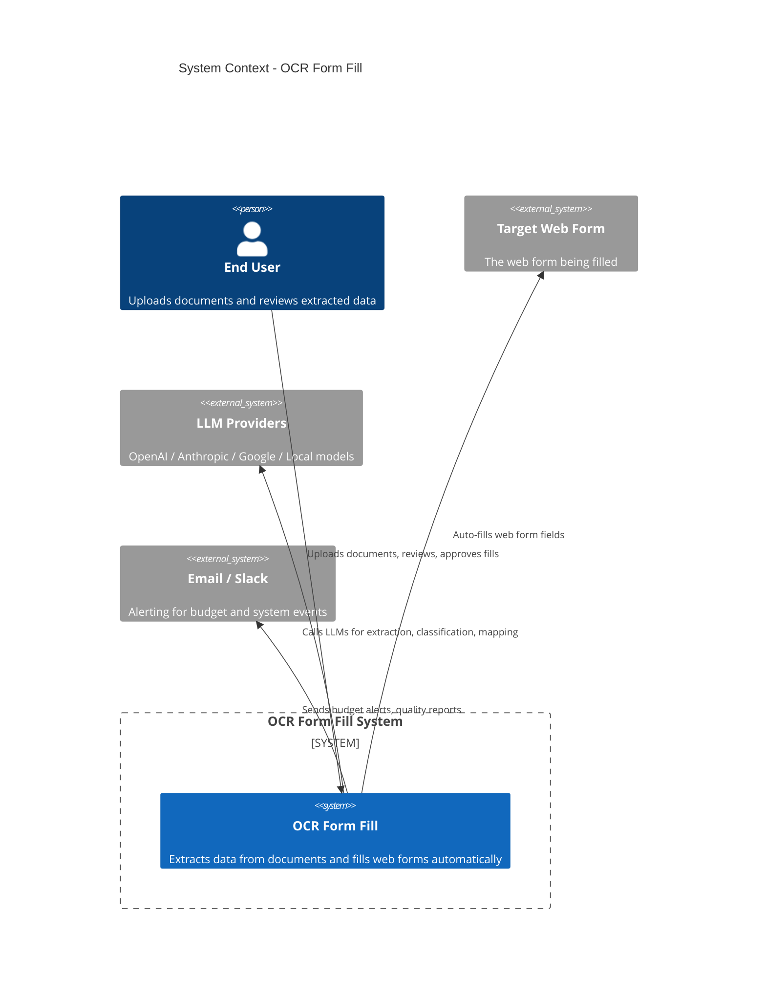
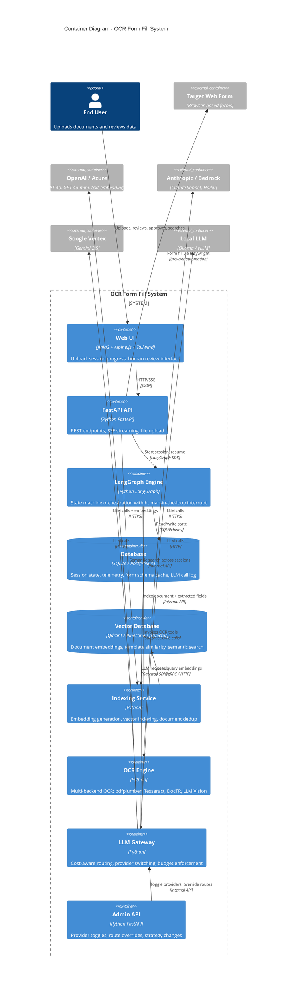
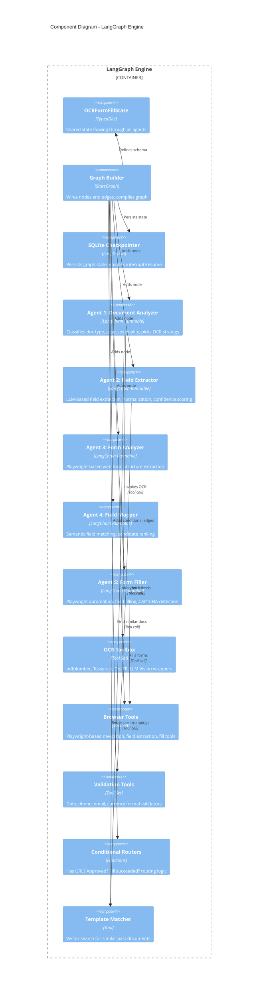
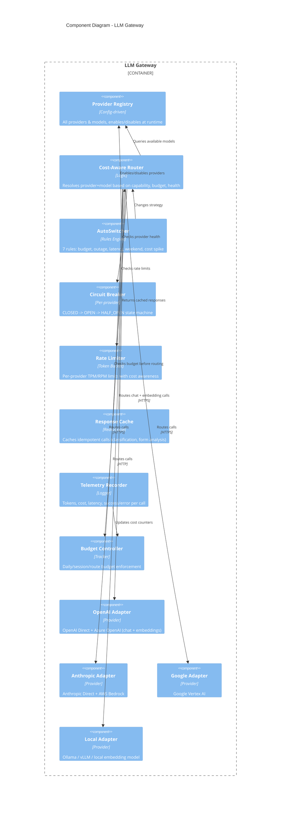
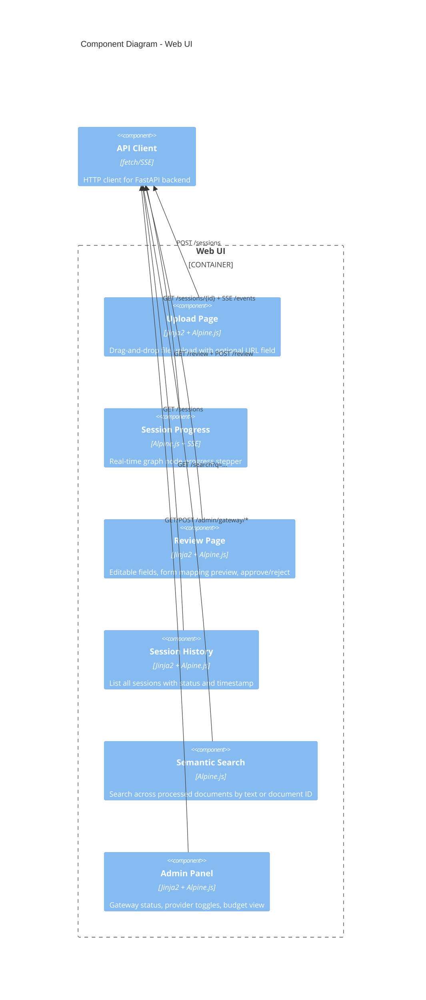

# OCR Form Fill System — Architecture

> Standalone service: upload documents -> [INPUT GUARDRAILS] -> OCR -> extract fields -> map to web forms -> human review -> [OUTPUT GUARDRAILS] -> auto-fill -> [AUDIT LOG]
>
> **Safeguards integrated at every boundary.** See `2026-07-21-ocr-safeguards-audit.md` for the full audit.

---

## 1. C4 Context Diagram (Level 1)

Shows the system in scope and its relationships with external actors and systems.



---

## 2. C4 Container Diagram (Level 2)

Shows the high-level containers that make up the system.



---

## 3. C4 Component Diagram (Level 3)

Decomposes the key containers into their internal components.

### 3.1 LangGraph Engine — Internal Components



### 3.2 Indexing Service — Internal Components

```mermaid
C4Component
  title Component Diagram - Indexing & Vector Search

  Container_Boundary(indexer, "Indexing Service") {
    Component(embedder, "Embedding Generator", "LLM Gateway", "Generates embeddings via OpenAI/text-embedding-3 or local model")
    Component(doc_indexer, "Document Indexer", "Logic", "Indexes OCR text + extracted fields + metadata per session")
    Component(template_indexer, "Template Indexer", "Logic", "Indexes document layout fingerprints for template matching")
    Component(form_indexer, "Form Schema Indexer", "Logic", "Indexes web form field structures for similarity search")
    Component(search_engine, "Semantic Search Engine", "Logic", "Cross-session full-text + vector search across documents")
    Component(dedup, "Deduplication Checker", "Logic", "SHA-256 + vector similarity to detect duplicate uploads")
  }

  ContainerDb(vdb, "Vector Database", "Qdrant / pgvector", "Stores embeddings with metadata filters")

  Rel(embedder, gateway, "Calls embedding model", "Gateway SDK")
  Rel(doc_indexer, embedder, "Generate doc embedding")
  Rel(doc_indexer, vdb, "Store document vector + metadata")
  Rel(template_indexer, embedder, "Generate template embedding")
  Rel(template_indexer, vdb, "Store template vector")
  Rel(form_indexer, embedder, "Generate form structure embedding")
  Rel(form_indexer, vdb, "Store form vector")
  Rel(search_engine, vdb, "Query by vector similarity")
  Rel(search_engine, embedder, "Embed search query")
  Rel(dedup, vdb, "Check for existing similar docs")
```

### 3.3 LLM Gateway — Internal Components



### 3.4 Web UI — Internal Components



---

## 4. LangGraph Agent Topology (with Safeguards)

```
                    START
                      |
                      v
            +=========================+
            |  INPUT GUARDRAILS        |
            |  - Document validation   |
            |  - Magic byte check      |
            |  - Malware scan          |
            |  - PII detection         |
            |  - Abuse rate limit      |
            |  - Budget reserve        |
            |  BLOCK -> audit + reject |
            +=========================+
                      | (passed)
                      v
            +---------------------+
            | Agent 1: Document   |
            | Analyzer            |
            | (classify, pick     |
            |  OCR strategy)      |
            | [Vector: find       |
            |  similar template]  |
            +---------+-----------+
                      |
                      v
            +---------------------+
            | Tool : OCR Engine   |
            | (pdfplumber /       |
            |  Tesseract / DocTR  |
            |  / LLM Vision)      |
            +---------+-----------+
                      |
                      v
            +---------------------+
            | Agent 2: Field      |
            | Extractor           |
            | (LLM extraction,    |
            |  normalize,         |
            |  confidence score)  |
            +---------+-----------+
                      |
                      v
            +=========================+
            |  PII SCAN               |
            |  - Scan extracted fields |
            |  - Mask PII in UI       |
            |  - Prevent re-entry     |
            |    to LLM with PII      |
            +=========================+
                      |
                      v
         +---------------------------+
         | Has target URL?            |
         +-------------+-------------+
                       |
              +--------+--------+
              |                 |
              v                 v
    +----------------+   +----------------+
    | Agent 3: Form  |   | Skip (no form  |
    | Analyzer       |   | analysis)      |
    | [URL safety    |   +----------------+
    |  check]        |
    | (Playwright,   |
    |  extract       |
    |  form fields)  |
    +-------+--------+
            |
            v
    +---------------------+
    | Agent 4: Field      |
    | Mapper              |
    | (semantic match,    |
    |  rank candidates,   |
    |  confidence score)  |
    | [Vector: search     |
    |  past mappings]     |
    +---------+-----------+
              |
              v
    +=========================+
    |  OUTPUT GUARDRAILS      |
    |  - Field validation     |
    |  - Injection scan       |
    |  - Confidence gate      |
    |  BLOCK -> re-extract    |
    +=========================+
              | (passed)
              v
    +=========================+
    |  HUMAN REVIEW INTERRUPT  |
    |  (Web UI: review, edit,  |
    |   approve, reject)       |
    +=========================+
              |
         (approved)
              v
    +=========================+
    |  PRE-FILL SAFETY CHECK  |
    |  - URL still reachable  |
    |  - Form still exists    |
    |  - Destructive action?  |
    |  - Fill mode (test/safe)|
    +=========================+
              | (passed)
              v
    +---------------------+
    | Agent 5: Form       |
    | Filler              |
    | (Playwright fill    |
    |  fields, screenshot,|
    |  CAPTCHA detection) |
    +---------+-----------+
              |
              v
    +=========================+
    |  BOT DETECTION          |
    |  SAFEGUARD              |
    |  - CAPTCHA stop         |
    |  - Rate limit backoff   |
    |  - Max retries (1)      |
    +=========================+
              |
              v
    +---------------------+
    | Indexing Hook        |
    | (vector embeddings   |
    |  for doc + fields +  |
    |  form schema)        |
    +---------------------+
              |
              v
    +=========================+
    |  AUDIT LOG              |
    |  - Immutable INSERT     |
    |  - All events recorded  |
    |  - Compliance-ready     |
    +=========================+
              |
              v
    +---------------------+
    | Complete / Receipt   |
    +---------------------+
```

**Key:**
- `=====` boxes = Safeguard nodes (NEW)
- `-----` boxes = Agent / Tool nodes (existing)
- Safeguard failures route to audit log + human notification, not silent skip

---

## 5. Sequence Diagram — End-to-End Data Flow

```mermaid
sequenceDiagram
    participant User
    participant WebUI as Web UI
    participant API as FastAPI API
    participant LG as LangGraph
    participant A1 as Agent 1: Doc Analyzer
    participant OCR as OCR Engine
    participant A2 as Agent 2: Field Extractor
    participant A3 as Agent 3: Form Analyzer
    participant A4 as Agent 4: Field Mapper
    participant A5 as Agent 5: Form Filler
    participant IDX as Indexing Service
    participant VDB as Vector DB
    participant GW as LLM Gateway
    participant DB as Database
    participant Browser as Target Web Form

    Note over User, Browser: === PHASE 1: UPLOAD ===
    User->>WebUI: Upload PDF/image (+ optional target URL)
    WebUI->>API: POST /api/v1/sessions (multipart)
    API->>DB: Save file, create session record
    API->>IDX: Check for duplicate upload (hash + vector sim)
    IDX->>VDB: Query by SHA-256 hash
    VDB-->>IDX: No duplicate found
    IDX-->>API: Continue processing
    API->>LG: Start graph execution (thread_id)
    API-->>WebUI: 201 { session_id, status: "analyzing" }
    WebUI-->>User: Show progress stepper

    Note over User, Browser: === PHASE 2: DOCUMENT ANALYSIS ===
    LG->>A1: Run - analyze document
    A1->>API: Get file metadata (pages, DPI, size)
    A1->>GW: classify_document(file_features)
    GW->>GW: Route to cheapest (gpt-4o-mini)
    GW-->>A1: { doc_type: "invoice", quality: "high" }
    A1->>A1: Recommend OCR strategy: doctr
    A1->>VDB: Search similar document templates (layout hash)
    VDB-->>A1: { found: true, template_id: "tpl_inv_042", confidence: 0.94 }
    A1-->>LG: state updated (doc_type, quality, strategy, template_match)

    Note over User, Browser: === PHASE 3: OCR ===
    LG->>OCR: Execute OCR (strategy=doctr)
    OCR->>OCR: Preprocess (deskew, denoise, enhance)
    OCR->>OCR: Run DocTR engine
    alt confidence < 0.7
        OCR->>GW: escalate_to_llm_vision(page_image)
        GW->>GW: Route to quality (gpt-4o)
        GW-->>OCR: vision text output
    end
    OCR-->>LG: raw_text + layout_blocks

    Note over User, Browser: === PHASE 4: FIELD EXTRACTION ===
    LG->>A2: Run - extract fields
    alt Template matched in Phase 2
        A2->>VDB: Load template extraction schema
        VDB-->>A2: { expected_fields: ["invoice_no", "vendor", "total", "date"], patterns: {...} }
    end
    A2->>GW: extract_fields(raw_text, layout)
    GW->>GW: Route to quality (claude-sonnet-4)
    GW-->>A2: extracted fields with confidence
    A2->>GW: validate_date("2024-01-15")
    A2->>GW: normalize_currency("$1,249.99")
    A2-->>LG: state updated (extracted_fields, low_confidence)

    alt Has target URL
        Note over User, Browser: === PHASE 5: FORM ANALYSIS ===
        LG->>A3: Run - analyze form
        A3->>VDB: Search similar form schemas (domain + field structure)
        VDB-->>A3: { found: true, form_schema_id: "frm_payment_01", similarity: 0.89 }
        alt Form schema from vector DB is good enough
            A3->>A3: Use cached form schema (skip Playwright)
        else No match or low confidence
            A3->>Browser: Playwright: navigate to URL
            Browser-->>A3: Page loaded
            A3->>Browser: Extract all <form> elements
            Browser-->>A3: Form fields with selectors
            A3->>GW: infer_field_semantics(form_fields)
            GW-->>A3: enriched form field metadata
        end
        A3-->>LG: state updated (form_fields)
    end

    Note over User, Browser: === PHASE 6: FIELD MAPPING ===
    LG->>A4: Run - map fields
    A4->>VDB: Search historical mappings (extracted field -> form field)
    VDB-->>A4: { mappings: {...}, avg_confidence: 0.91 }
    A4->>GW: semantic_match("Full Name", ["customer_name", "fname", ...])
    GW-->>A4: { best_match: "customer_name", score: 0.94 }
    alt Historical mapping found
        A4->>A4: Boost confidence from historical match (+0.10)
    end
    A4-->>LG: state updated (field_mappings, unmapped_fields)

    Note over User, Browser: === PHASE 7: HUMAN REVIEW ===
    LG->>LG: INTERRUPT - wait for human input
    LG-->>API: State serialized, interrupt fired
    API-->>WebUI: SSE: status="awaiting_review"
    WebUI-->>User: Show review screen
    User->>WebUI: Correct values, map unmapped, approve
    WebUI->>API: POST /api/v1/sessions/{id}/review
    API->>LG: Resume with corrections + approved mappings
    LG->>LG: Update state with human_corrections

    Note over User, Browser: === PHASE 8: FORM FILL ===
    LG->>A5: Run - fill form
    A5->>Browser: Playwright: navigate to URL
    Browser-->>A5: Page loaded
    loop Each mapped field
        A5->>Browser: Fill field (selector, value)
        Browser-->>A5: Field filled
    end
    A5->>Browser: Detect CAPTCHA
    alt CAPTCHA detected
        A5->>A5: STOP - mark as captcha_blocked
    else No CAPTCHA
        A5->>Browser: Take proof screenshot
        Browser-->>A5: Screenshot saved
    end
    A5-->>LG: state updated (fill_status, submission_proof)

    Note over User, Browser: === PHASE 9: INDEXING ===
    LG->>IDX: Index session results
    IDX->>IDX: Generate embeddings:
    IDX->>GW: embed_document(ocr_text + extracted_fields)
    GW-->>IDX: vector[1536]
    IDX->>VDB: Store document vector + metadata (session_id, doc_type, fields)
    IDX->>GW: embed_template(layout_fingerprint)
    GW-->>IDX: template_vector
    IDX->>VDB: Store template vector
    alt Form was analyzed
        IDX->>GW: embed_form_structure(form_fields)
        GW-->>IDX: form_vector
        IDX->>VDB: Store form schema vector
    end
    IDX->>VDB: Store field mappings as learnings
    IDX-->>LG: Indexing complete

    Note over User, Browser: === PHASE 10: COMPLETE ===
    LG->>LG: Self-evaluation (quality + cost)
    LG->>DB: Persist final state + telemetry
    LG-->>API: Graph complete
    API-->>WebUI: SSE: status="completed"
    WebUI-->>User: Show completion receipt
    User->>WebUI: GET /receipt
    WebUI->>API: GET /api/v1/sessions/{id}/receipt
    API-->>WebUI: { fill_status, screenshot_url, costs }
    WebUI-->>User: Receipt with proof

    Note over User, Browser: === POST-SESSION: SEARCH ===
    User->>WebUI: Search "invoices over $1000 from Acme"
    WebUI->>API: GET /api/v1/search?q=invoices+over+$1000+Acme
    API->>IDX: embed_query("invoices over $1000 from Acme")
    IDX->>GW: embed_search_query(query_text)
    GW-->>IDX: query_vector
    IDX->>VDB: Vector search + metadata filter (doc_type=invoice, total_amount>1000, vendor=Acme)
    VDB-->>IDX: top 5 sessions with similarity scores
    IDX-->>API: { results: [{ session_id, doc_type, extracted_fields, score: 0.92 }, ...] }
    API-->>WebUI: search results
    WebUI-->>User: Show matching documents with preview
```



---

## 6. Vector Database & Indexing Strategy

### 6.1 What Gets Indexed

```
  +---------------------+       +-------------------------------+
  |  Document Vector     |       |  Additional Embeddings        |
  |                      |       |                               |
  |  session_id (PK)     |       |  +  Template Fingerprint      |
  |  doc_type            |       |     (layout hash + vector)    |
  |  ocr_text            |       |                               |
  |  extracted_fields    |       |  +  Form Schema Vector        |
  |  quality_score       |       |     (field labels + types)    |
  |  embedding (1536d)   |       |                               |
  |  created_at          |       |  +  Field Mapping History     |
  +----------------------+       |     (extracted -> form)       |
                                 |                               |
                                 |  +  Search Index              |
                                 |     (full-text + vector)      |
                                 +-------------------------------+
```

### 6.2 Vector DB Collections

```python
VECTOR_COLLECTIONS = {
    "documents": {
        "description": "Processed document embeddings for semantic search and dedup",
        "embedding_model": "text-embedding-3-large",    # 1536 dimensions
        "index_type": "HNSW",                            # Fast approximate nearest neighbor
        "metadata_fields": [
            "session_id", "doc_type", "quality", "ocr_strategy",
            "fill_status", "total_cost_usd", "created_at",
        ],
        "payload_fields": [                              # Filterable without vector search
            "extracted_fields",                          # JSON blob of field names + values
            "template_id",                               # Matched template, if any
        ],
    },
    "templates": {
        "description": "Document layout fingerprints for template matching",
        "embedding_model": "text-embedding-3-small",    # 512 dimensions, cheaper
        "index_type": "HNSW",
        "metadata_fields": [
            "template_id", "doc_type", "page_count",
            "times_matched", "avg_confidence",
        ],
    },
    "form_schemas": {
        "description": "Web form structure embeddings for form caching",
        "embedding_model": "text-embedding-3-small",
        "index_type": "HNSW",
        "metadata_fields": [
            "domain", "url_pattern", "field_count",
            "times_used", "last_correction_rate",
        ],
    },
    "field_mappings": {
        "description": "Historical field-to-form mappings for reuse",
        "embedding_model": "text-embedding-3-small",
        "index_type": "HNSW",
        "metadata_fields": [
            "extracted_field_key", "form_field_id", "domain",
            "confidence", "human_verified", "times_used",
        ],
    },
}
```

### 6.3 Indexing Pipeline

```python
class IndexingPipeline:
    """
    Runs after every completed session. Indexes document content,
    template fingerprint, form schema, and field mappings into the vector DB.
    """

    COLLECTION_CONFIG = {
        "documents":     {"model": "text-embedding-3-large", "dims": 1536},
        "templates":     {"model": "text-embedding-3-small", "dims": 512},
        "form_schemas":  {"model": "text-embedding-3-small", "dims": 512},
        "field_mappings":{"model": "text-embedding-3-small", "dims": 512},
    }

    async def index_session(self, state: OCRFormFillState):
        """Index all artifacts from a completed session."""
        tasks = []

        # 1. Document embedding (full-text + semantic search)
        tasks.append(self._index_document(state))

        # 2. Template fingerprint (if new template discovered)
        if state.get("template_id") and state.get("is_new_template"):
            tasks.append(self._index_template(state))

        # 3. Form schema (if a form was analyzed)
        if state.get("form_fields"):
            tasks.append(self._index_form_schema(state))

        # 4. Field mappings (for reuse in future mapping)
        if state.get("field_mappings"):
            tasks.append(self._index_field_mappings(state))

        await asyncio.gather(*tasks)

    async def _index_document(self, state: OCRFormFillState):
        """Generate document embedding and store in vector DB."""
        # Build text for embedding: combine OCR text + field names + values
        text_for_embedding = self._build_document_text(state)
        embedding = await self._generate_embedding(text_for_embedding, "documents")

        # Hybrid search: also index individual field values as keywords
        await self.vector_db.upsert(
            collection="documents",
            points=[{
                "id": state["session_id"],
                "vector": embedding,
                "payload": {
                    "session_id": state["session_id"],
                    "doc_type": state.get("doc_type"),
                    "quality": state.get("doc_quality"),
                    "ocr_strategy": state.get("ocr_strategy"),
                    "fill_status": state.get("fill_status"),
                    "total_cost_usd": cost_tracker.session_cost(state["session_id"]),
                    "extracted_fields": state.get("extracted_fields"),
                    "created_at": state.get("created_at"),
                },
            }]
        )

    async def _index_template(self, state: OCRFormFillState):
        """Index document layout fingerprint for template matching."""
        layout_fingerprint = self._build_layout_fingerprint(state.get("layout_blocks"))
        embedding = await self._generate_embedding(layout_fingerprint, "templates")

        await self.vector_db.upsert(
            collection="templates",
            points=[{
                "id": state["template_id"],
                "vector": embedding,
                "payload": {
                    "template_id": state["template_id"],
                    "doc_type": state.get("doc_type"),
                    "page_count": len(state.get("layout_blocks", [])),
                    "times_matched": 1,
                },
            }]
        )

    async def _index_form_schema(self, state: OCRFormFillState):
        """Index web form structure for form cache."""
        form_text = self._form_fields_to_text(state["form_fields"])
        embedding = await self._generate_embedding(form_text, "form_schemas")
        domain = extract_domain(state.get("target_url", ""))

        await self.vector_db.upsert(
            collection="form_schemas",
            points=[{
                "id": f"form_{domain}_{state['session_id']}",
                "vector": embedding,
                "payload": {
                    "domain": domain,
                    "url_pattern": extract_pattern(state["target_url"]),
                    "field_count": len(state["form_fields"]),
                    "times_used": 1,
                },
            }]
        )

    async def _index_field_mappings(self, state: OCRFormFillState):
        """Index approved field mappings for future reuse."""
        points = []
        for extracted_key, mapping in state.get("field_mappings", {}).items():
            text = f"{extracted_key} -> {mapping['form_field_id']}"
            embedding = await self._generate_embedding(text, "field_mappings")

            points.append({
                "id": f"map_{state['session_id']}_{extracted_key}",
                "vector": embedding,
                "payload": {
                    "extracted_field_key": extracted_key,
                    "form_field_id": mapping["form_field_id"],
                    "domain": extract_domain(state.get("target_url", "")),
                    "confidence": mapping.get("confidence", 0.0),
                    "human_verified": bool(state.get("human_corrections")),
                    "times_used": 1,
                },
            })

        await self.vector_db.upsert(collection="field_mappings", points=points)

    async def _generate_embedding(self, text: str, collection: str) -> list[float]:
        """Generate embedding via LLM gateway (routes to cheapest embedding model)."""
        config = self.COLLECTION_CONFIG[collection]
        response = await gateway.embed(
            text=text,
            model=config["model"],
            dimensions=config["dims"],
        )
        return response.embedding
```

### 6.4 Vector Search Use Cases

**Use Case 1: Template Matching (Agent 1 — Document Analyzer)**

When a document is uploaded, check if a similar template was processed before to reuse extraction schema:

```python
class TemplateMatcher:
    """Find the most similar previously processed document template."""

    async def find_match(self, doc_type: str, layout_blocks: list) -> TemplateMatch | None:
        # Build a lightweight layout fingerprint from layout blocks
        fingerprint = self._fingerprint_layout(layout_blocks)

        # Generate embedding
        embedding = await gateway.embed(
            text=fingerprint,
            model="text-embedding-3-small",
            dimensions=512,
        )

        # Vector search with doc_type filter
        results = await vector_db.search(
            collection="templates",
            vector=embedding,
            limit=3,
            filter={"doc_type": doc_type},
            score_threshold=0.85,
        )

        if results:
            best = results[0]
            return TemplateMatch(
                template_id=best.payload["template_id"],
                similarity=best.score,
                expected_fields=best.payload.get("expected_fields", []),
            )
        return None
```

**Use Case 2: Semantic Document Search (Web UI)**

Users search across all processed documents by natural language:

```python
class SemanticSearchEngine:
    """Search across processed documents by semantic similarity + metadata filter."""

    async def search(self, query: str, filters: dict = None) -> list[SearchResult]:
        # 1. Embed the query
        query_embedding = await gateway.embed(
            text=query,
            model="text-embedding-3-large",
            dimensions=1536,
        )

        # 2. Vector search with optional metadata filters
        results = await vector_db.search(
            collection="documents",
            vector=query_embedding,
            limit=20,
            filter=filters,       # e.g. {"doc_type": "invoice"}
        )

        # 3. Optionally re-rank with LLM for precision
        if results:
            results = await self._rerank_with_llm(query, results)

        return [
            SearchResult(
                session_id=r.payload["session_id"],
                doc_type=r.payload["doc_type"],
                extracted_fields=r.payload["extracted_fields"],
                similarity=r.score,
                created_at=r.payload["created_at"],
            )
            for r in results
        ]

    async def _rerank_with_llm(self, query: str, results: list) -> list:
        """Optional cross-encoder style reranking using LLM."""
        prompt = f"Query: {query}\nRank these results by relevance:\n"
        for i, r in enumerate(results):
            prompt += f"{i}. Doc type: {r.payload['doc_type']}, Fields: {r.payload['extracted_fields']}\n"
        prompt += "\nReturn the indices in order of relevance, most relevant first."

        response = await gateway.call(
            route_key="rerank",
            prompt=prompt,
            max_tokens=100,
        )
        # Parse response to reorder results
        return reordered_results
```

**Use Case 3: Historical Mapping Boost (Agent 4 — Field Mapper)**

Before doing expensive LLM semantic matching, check if this exact mapping was done before:

```python
class HistoricalMappingSearch:
    """Search past field mappings to reuse human-verified mappings."""

    async def find_mapping(self, extracted_key: str, domain: str) -> MappingHint | None:
        embedding = await gateway.embed(
            text=extracted_key,
            model="text-embedding-3-small",
            dimensions=512,
        )

        results = await vector_db.search(
            collection="field_mappings",
            vector=embedding,
            limit=1,
            filter={"domain": domain},
            score_threshold=0.90,
        )

        if results:
            return MappingHint(
                form_field_id=results[0].payload["form_field_id"],
                confidence_boost=0.10,
                human_verified=results[0].payload.get("human_verified", False),
            )
        return None
```

**Use Case 4: Duplicate Detection (Before Processing)**

```python
class DuplicateDetector:
    """Detect if the same document was uploaded before."""

    async def check_duplicate(self, file_path: str) -> DuplicateResult | None:
        # 1. Fast path: exact SHA-256 match
        file_hash = hashlib.sha256(open(file_path, "rb").read()).hexdigest()
        exact = await vector_db.search(
            collection="documents",
            filter={"file_hash": file_hash},     # Exact metadata filter
            limit=1,
        )
        if exact:
            return DuplicateResult(is_duplicate=True, existing_session=exact[0].payload["session_id"], method="exact_hash")

        # 2. Slow path: vector similarity (same content, different format)
        ocr_preview = await run_fast_ocr_first_page(file_path)
        embedding = await gateway.embed(text=ocr_preview, model="text-embedding-3-large", dimensions=1536)
        similar = await vector_db.search(
            collection="documents",
            vector=embedding,
            limit=1,
            score_threshold=0.97,
        )
        if similar:
            return DuplicateResult(is_duplicate=True, existing_session=similar[0].payload["session_id"], method="vector_similarity")

        return DuplicateResult(is_duplicate=False)
```

### 6.5 Vector DB Technology Options

| Choice | Pros | Cons | Best For |
|--------|------|------|----------|
| **pgvector** (PostgreSQL extension) | No additional infrastructure; ACID compliance; works with existing DB | Limited scaling at massive scale; fewer features than dedicated DB | Small to medium deployments |
| **Qdrant** | Fast HNSW indexing; rich filtering; Docker-friendly; Rust-based performance | Separate service to manage | Primary recommendation |
| **Pinecone** | Fully managed; zero ops; highest throughput | Vendor lock-in; cost at scale | Serverless / low-ops teams |
| **LanceDB** | Embedded (no server); columnar; multi-modal | Newer ecosystem | Local dev / single-node |

**Recommendation:** Qdrant for production (self-hosted via Docker, scales well, rich filtering). pgvector for development (no extra service).

---

## 7. LLM Gateway Architecture

```
  +------------------------------------------------------------------+
  |  LLM GATEWAY SERVICE                                              |
  |                                                                   |
  |  +-------------+   +-------------+   +------------------------+  |
  |  | Cost-Aware  |-->| Rate        |-->| Provider Router        |  |
  |  | Router      |   | Limiter     |   | (Dynamic: strategy,    |  |
  |  | (budget,    |   | (token      |   |  circuit breaker,     |  |
  |  |  strategy,  |   |  bucket)    |   |  health, availability) |  |
  |  |  capability)|   |             |   +-----------+------------+  |
  |  +-------------+   +-------------+               |               |
  |                                                   v               |
  |                          +----------------------------------------------------+
  |                          |  Provider Adapters                                   |
  |                          |  +---------+ +---------+ +---------+ +-----------+  |
  |                          |  | OpenAI  | | Claude  | | Google  | | Local     |  |
  |                          |  | Chat +  | | Chat    | | Chat    | | Chat +    |  |
  |                          |  | Embed   | |         | |         | | Embed     |  |
  |                          |  +---------+ +---------+ +---------+ +-----------+  |
  |                          +----------------------------------------------------+
  |                                                                   |
  |  +----------------------------------------------------------------+
  |  |  Observability & Cost Control Layer                              |
  |  |  (telemetry, cost tracker, budget controller, auto-switcher)    |
  |  +----------------------------------------------------------------+
  +------------------------------------------------------------------+
        |           ^
        v           |
  +------------------------------------------+
  |  LangChain Agent Runtime                  |
  |  (5 agents via GatewayCallback)          |
  +------------------------------------------+
```

### Switching Strategies

| Strategy | Behavior | Routes |
|----------|----------|--------|
| `cost_optimized` | Always pick cheapest capable model | classification, mapping, form analysis, embeddings |
| `quality_optimized` | Always pick most capable model | vision OCR, field extraction |
| `balanced` | Best model; downgrade if budget tight | Default for all others |
| `manual` | Admin pins a specific provider:model | Debugging, experiments |

### Auto-Switch Triggers (7 rules)

| Trigger | Condition | Action |
|---------|-----------|--------|
| Budget 80% | Daily usage > 80% | Downgrade non-critical routes to cheapest |
| Budget 95% | Daily usage > 95% | Downgrade ALL routes to cheapest |
| Provider outage | Error rate > 10% | Disable provider, route elsewhere |
| Provider recovery | Healthy for 10+ min | Re-enable provider |
| Latency degradation | p95 > 10s | Reduce provider priority |
| Weekend economy | Sat/Sun | All routes -> cheapest |
| Cost spike | Session cost +20% vs 7d avg | All routes -> cheapest |

---

## 8. Budget Control Hierarchy

```
  MONTHLY HARD CAP: $2,500
       |
       +-- DAILY HARD CAP: $100
       |     |
       |     +-- (80%) Soft limit -> auto-downgrade non-critical
       |     +-- (95%) Critical limit -> force cheapest on everything
       |
       +-- PER-SESSION CAP: $0.50
       |     |
       |     +-- ($0.30) Soft limit -> downgrade model mid-session
       |
       +-- PER-ROUTE CAPS
             |
             +-- vision_ocr:        $0.03/call
             +-- field_extraction:  $0.02/call
             +-- doc_classification:$0.005/call
             +-- semantic_mapping:  $0.005/call
             +-- form_analysis:     $0.01/call
             +-- embedding:         $0.0001/call  (very cheap)
```

---

## 9. Cache Hierarchy (All Layers)

```
  L1: LLM Response Cache (Redis)
    - Key: hash(route + prompt)
    - TTL: 10 min - 1 hr
    - Routes: classification, form analysis, semantic mapping
    - Miss penalty: $0.001-0.01 LLM call

  L2: Form Schema Cache (PostgreSQL + Vector DB)
    - Key: domain + URL pattern (hybrid: exact + vector similarity)
    - TTL: 24 hr (or until form changes)
    - Benefit: Skip 5-10s Playwright analysis
    - Self-learning: new schemas stored after each analysis

  L3: OCR Result Cache (Redis)
    - Key: SHA-256(file) + OCR strategy
    - TTL: 7 days
    - Benefit: Skip 10-60s OCR on duplicate uploads

  L4: Session State (SQLite/PostgreSQL checkpointer)
    - Key: session_id
    - Duration: until session completes or expires (24 hr)
    - Purpose: LangGraph interrupt/resume, not performance

  L5: Vector DB Index (Qdrant / pgvector)
    - Key: embedding vector + metadata filters
    - Duration: permanent (until session TTL cleanup)
    - Purpose: Semantic search, template matching, mapping reuse
```

---

## 10. Component Responsibilities

| Component | Responsibility |
|-----------|---------------|
| **FastAPI API** | REST endpoints, SSE streaming, file upload, auth, search queries |
| **LangGraph** | State machine orchestration, human-in-the-loop interrupt |
| **Agent 1** | Document classification, quality assessment, OCR strategy, template matching via vector DB |
| **Agent 2** | LLM field extraction, normalization, confidence scoring |
| **Agent 3** | Web form structure extraction, field semantic inference |
| **Agent 4** | Semantic field matching, candidate ranking, historical mapping search |
| **Agent 5** | Playwright browser automation, field filling, CAPTCHA detect |
| **OCR Engine** | Multi-backend: pdfplumber, Tesseract, DocTR, LLM Vision |
| **Indexing Service** | Embedding generation, vector indexing, deduplication, semantic search |
| **Vector Database** | Document embeddings, template vectors, form schema vectors, mapping history |
| **LLM Gateway** | Cost-aware routing, provider switching, budget enforcement, embedding calls |
| **Budget Controller** | Daily/session/route budget tracking, hard/soft limits |
| **AutoSwitcher** | Automatic provider switching based on 7 trigger conditions |
| **Input Guardrails** | Document validation (magic bytes, size, malware), PII detection, abuse rate limiting, budget reservation |
| **Output Guardrails** | Field validation, injection protection (XSS/SQL), confidence gate enforcement |
| **Pre-Fill Safety** | URL reachability check, form existence verification, destructive action detection, fill mode control |
| **PII Scanner** | Regex-based PII detection, masking for review UI, blocking before LLM re-entry |
| **Audit Logger** | Immutable INSERT-only audit trail, compliance-ready event logging |
| **Abuse Detector** | Per-user rate limits, pattern-based abuse detection, reserve/commit budget pattern |
| **Data Retention** | Auto-deletion policies (30d/7d/1d), GDPR right-to-deletion API, encryption at rest |
| **Web UI** | Upload, session progress, human review, corrections, semantic search |
| **Database** | Session state, telemetry, form schema cache, LLM call log, immutable audit log |

---

## 11. Project Structure (Updated with Vector DB)

```
ocr/
+-- app/
|   +-- main.py
|   +-- config.py
|   +-- api/v1/
|   |   +-- sessions.py
|   |   +-- review.py
|   |   +-- search.py                # <-- NEW: semantic search endpoint
|   |   +-- health.py
|   |   +-- schemas.py
|   +-- graph/                       # LangGraph engine
|   |   +-- state.py
|   |   +-- builder.py
|   |   +-- routers.py
|   |   +-- agents/{agent1-5}.py
|   |   +-- tools/
|   |       +-- ocr_toolbox.py
|   |       +-- browser_tools.py
|   |       +-- validation.py
|   |       +-- template_matcher.py   # <-- NEW: vector search tool for agents
|   +-- ocr/                         # OCR engine
|   +-- gateway/                     # LLM gateway
|   +-- vector/                      # <-- NEW: indexing service
|   |   +-- __init__.py
|   |   +-- client.py                # Vector DB connection (Qdrant/pgvector)
|   |   +-- indexer.py               # IndexingPipeline
|   |   +-- embeddings.py            # Embedding generation via gateway
|   |   +-- search.py                # SemanticSearchEngine
|   |   +-- dedup.py                 # DuplicateDetector
|   |   +-- schemas.py               # Collection schemas + payload models
|   +-- web/                         # Web UI
|   +-- models/
|   +-- db/
+-- docs/
+-- tests/
+-- docker-compose.yml               # <-- UPDATED: added Qdrant service
```

---

## 12. Key Architecture Decisions

| Decision | Choice | Rationale |
|----------|--------|-----------|
| Orchestration | LangGraph agents | State machine with interrupts fits human-in-the-loop |
| OCR strategy | Multi-tier fallback | ~80% cheap OCR, ~15% DocTR, ~5% LLM Vision |
| Provider switching | Dynamic + 7 auto-triggers | Cost control + reliability without manual intervention |
| Vector search | Template matching + historical mapping reuse | Reduces LLM cost by reusing past results; enables semantic search |
| Vector DB | Qdrant (prod) / pgvector (dev) | Fast HNSW indexing, rich filtering, self-hosted |
| Embedding model | text-embedding-3-large (docs) / 3-small (templates) | Large for precision search, small for cheap template matching |
| Human review | Graph interrupt node | Mandatory checkpoint, not optional |
| Browser automation | Playwright (async) | Async-native, auto-waiting, faster than Selenium |
| Frontend | Jinja2 + Alpine.js | No build step, lightweight, fits FastAPI |
| State persistence | SQLite (dev) / PostgreSQL (prod) | LangGraph checkpointer compatibility |

---

*See `2026-07-21-ocr-form-fill-design.md` for the full design document.*
*See `2026-07-21-ocr-cross-cutting-evaluation.md` for LLM gateway, cost control, ranking, self-reflection, and CI/CD details.*
*See `2026-07-21-ocr-safeguards-audit.md` for input/output guardrails, PII, injection protection, audit logging, and data retention details.*
